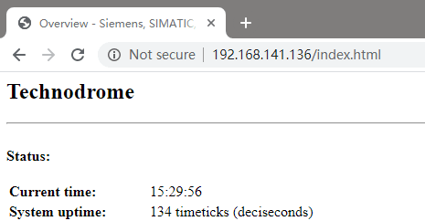

# 安防设施搭建使用

---

## 免责声明

`本文档仅供学习和研究使用,请勿使用文中的技术源码用于非法用途,任何人造成的任何负面影响,与本人无关.`

---

# 蜜罐
## Conpot

**项目地址**
- https://github.com/mushorg/conpot

**搭建过程**
```
docker pull honeynet/conpot
sudo docker run -it -p 80:8800 -p 102:10201 -p 502:5020 -p 161:16100/udp --network=bridge honeynet/conpot
```

访问 http://IP



---

# IDS & IPS
## Snort

<p align="center">
    
</p>

**官网**
- https://www.snort.org/

**简介**

Snort 是开源的基于误用检测的网络入侵检测系统，采用规则匹配机制检测网络分组是否违反了事先配置的安全策略。安装在一台主机上就可以监测整个共享网段，一旦发现入侵和探测行为，具有将报警信息发送到系统日志、报警文件或控制台屏幕等多种实时报警方式。Snort不仅能够检测各种网络攻击，还具有网络分组采集、分析和日志记录功能。相对于昂贵与庞大的商用产品而言，Snort 具有系统规模小、容易安装、容易配置、规则灵活和插件（plug-in）扩展等诸多优点。

**组成**

Snort主要由分组协议分析器、入侵检测引擎、日志记录和报警模块组成。协议分析器的任务就是对协议栈上的分组进行协议解析，以便提交给入侵检测引擎进行规则匹配。入侵检测引擎根据规则文件匹配分组特征，当分组特征满足检测规则时，触发指定的响应操作。日志记录将解析后的分组以文本或 Tcpdump 二进制格式记录到日志文件，文本格式便于分组分析，二进制格式提高记录速度。报警信息可以发送到系统日志；也可以采用文本或 Tcpdump 二进制格式发送到报警文件；也容许选择关闭报警操作。记录到报警文件的报警信息有完全和快速两种方式，完全报警记录分组首部所有字段信息和报警信息，而快速报警只记录分组首部部分字段信息。

**安装**
- **rpm 包安装**

    这里以 2.9.15-1 为例,最新版访问官网了解 https://www.snort.org
    ```bash
    yum install https://www.snort.org/downloads/snort/snort-2.9.15-1.centos7.x86_64.rpm
    ```

    安装 snort 的时候可能会报错 : `缺少 libnghttp2.so.14()(64bit)`
    ```bash
    yum install epel-release -y
    yum install nghttp2
    ```

    测试: `snort` ,如果没有报错则安装成功.

    如果报错 `snort: error while loading shared libraries: libdnet.1: cannot open shared object file: No such file or directory`
    ```bash
    wget http://prdownloads.sourceforge.net/libdnet/libdnet-1.11.tar.gz
    tar -xzvf libdnet-1.11.tar.gz
    ./configure
    make && make install
    ```

- **Centos 下源代码编译安装**

    安装依赖
    ```bash
    yum install -y gcc flex bison zlib zlib-devel libpcap libpcap-devel pcre pcre-devel libdnet libdnet-devel tcpdump openssl openssl-devel
    ```

    ```bash
    wget https://www.snort.org/downloads/snort/daq-2.0.6.tar.gz
    wget https://www.snort.org/downloads/snort/snort-2.9.15.tar.gz
    ```
    ```bash
    tar xvzf daq-2.0.6.tar.gz

    cd daq-2.0.6
    ./configure && make && sudo make install
    cd ../
    ```
    ```bash
    wget http://luajit.org/download/LuaJIT-2.0.5.tar.gz
    tar xvzf LuaJIT-2.0.5.tar.gz
    cd LuaJIT-2.0.5
    make install
    ```
    ```bash
    tar xvzf snort-2.9.15.tar.gz

    cd snort-2.9.15
    ./configure --enable-sourcefire && make && sudo make install
    ```

    测试: `snort` ,如果没有报错则安装成功.

- **Ubuntu 下源代码编译安装**
    ```
    apt update
    apt install -y build-essential libpcap-dev libpcre3-dev libdumbnet-dev bison flex zlib1g-dev liblzma-dev openssl libssl-dev libnghttp2-dev autoconf libtool
    mkdir ~/snort_src
    cd ~/snort_src
    wget https://snort.org/downloads/snort/daq-2.0.7.tar.gz
    tar -xvzf daq-2.0.7.tar.gz
    cd daq-2.0.7
    ./configure
    autoreconf -vfi
    make
    sudo make install

    cd ~/snort_src
    wget https://snort.org/downloads/snort/snort-2.9.16.tar.gz
    tar -xvzf snort-2.9.16.tar.gz
    cd snort-2.9.16
    ./configure --disable-open-appid
    make
    sudo make install
    sudo ldconfig
    sudo ln -s /usr/local/bin/snort /usr/sbin/snort
    ```

    测试: `snort` ,如果没有报错则安装成功.

> 注 : 如果安装中还是遇到报错的问题可以参考 https://blog.csdn.net/rdgfdd/article/details/83420811

**配置**

在使用 snort 之前，需要根据保护网络环境和安全策略对 snort 进行配置，主要包括网络变量、预处理器、输出插件及规则集的配置，位于 etc 的 snort 配置文件 snort.conf 可用任意文本编辑器打开。除内部网络环境变量 HOME_NET 之外，在大多数情况下，可以使用 snort.conf 的默认配置。

由于我们不想使用 root 权限来运行 snort，所以需要创建相关用户。同时也需要建立工作目录。
```bash
# Create the snort user and group:
sudo groupadd snort
sudo useradd snort -r -s /sbin/nologin -c SNORT_IDS -g snort

# Create the Snort directories:
sudo mkdir /etc/snort
sudo mkdir /etc/snort/rules
sudo mkdir /etc/snort/rules/iplists
sudo mkdir /etc/snort/preproc_rules
sudo mkdir /usr/local/lib/snort_dynamicrules
sudo mkdir /etc/snort/so_rules

# Create some files that stores rules and ip lists
sudo touch /etc/snort/rules/iplists/black_list.rules
sudo touch /etc/snort/rules/iplists/white_list.rules
sudo touch /etc/snort/rules/local.rules
sudo touch /etc/snort/sid-msg.map

# Create our logging directories:
sudo mkdir /var/log/snort
sudo mkdir /var/log/snort/archived_logs

# Adjust permissions:
sudo chmod -R 5775 /etc/snort
sudo chmod -R 5775 /var/log/snort
sudo chmod -R 5775 /var/log/snort/archived_logs
sudo chmod -R 5775 /etc/snort/so_rules
sudo chmod -R 5775 /usr/local/lib/snort_dynamicrules

# Change Ownership on folders:
sudo chown -R snort:snort /etc/snort
sudo chown -R snort:snort /var/log/snort
sudo chown -R snort:snort /usr/local/lib/snort_dynamicrules
```

移动配置文件
```bash
cd ~/snort_src/snort-2.9.16/etc/
sudo cp *.conf* /etc/snort
sudo cp *.map /etc/snort
sudo cp *.dtd /etc/snort
cd ~/snort_src/snort-2.9.16/src/dynamic-preprocessors/build/usr/local/lib/snort_dynamicpreprocessor/
sudo cp * /usr/local/lib/snort_dynamicpreprocessor/
sudo sed -i "s/include \$RULE\_PATH/#include \$RULE\_PATH/" /etc/snort/snort.conf
```

修改配置文件，将 HOME_NET 更改为自己电脑所在的 CIDR 地址
```bash
sudo vim /etc/snort/snort.conf

ipvar HOME_NET 10.0.0.0/24

...104

var RULE_PATH /etc/snort/rules
var SO_RULE_PATH /etc/snort/so_rules
var PREPROC_RULE_PATH /etc/snort/preproc_rules
var WHITE_LIST_PATH /etc/snort/rules/iplists
var BLACK_LIST_PATH /etc/snort/rules/iplists

...564

include $RULE_PATH/local.rules
```

**测试使用**
```bash
vim /etc/snort/rules/local.rules

alert icmp any any -> $HOME_NET any (msg:"ICMP test detected"; GID:1; sid:10000001; rev:001; classtype:icmp-event;)
```

```bash
sudo /usr/local/bin/snort -A console -q -u snort -g snort -c /etc/snort/snort.conf -i eth0
```
启动,此时用其他机器 Ping Snort 主机可以看到日志信息


也可以直接读取 pcap 包
```bash
sudo /usr/local/bin/snort -r foo.pcap
```

**规则下载**

Snort 官方提供的三类规则

- Community rules : 无需注册 or 购买,可直接下载使用
- Registered rules : 需要注册才可以下载
- Subscriber rules : 需要注册花钱购买

访问官网 https://www.snort.org/ 下载规则

下载完,解压至相应目录
```
cd /etc/snort/rules/
wget https://www.snort.org/downloads/community/community-rules.tar.gz -O community-rules.tar.gz
tar -xvf community-rules.tar.gz
mv /etc/snort/rules/community-rules/community.rules /etc/snort/rules/


sudo vim /etc/snort/snort.conf

include $RULE_PATH/community.rules
```

**其他 Snort 规则**

> PLC inject

```
alert tcp any any -> $any 502 (msg:”plcinject”; content:”|d0 9d 00 00 00 06 01 03 00 80 00 01|”; sid:001111111; GID:001; priority:0;)
```

**相关文章**
- [工控安全：入侵检测snort-安装配置及pcap规则编写思路](https://www.key1.top/index.php/archives/526/)

---

## Suricata

<p align="center">
    
</p>

**官网**
- https://suricata-ids.org/

**项目地址**
- https://github.com/OISF/suricata

**架构**

Suricata 有三种运行模式，分别为 single，workers，autofp。官方推荐性能最佳的运行模式为 workers 模式。
- single 模式：只有一个包处理线程，一般在开发模式下使用。
- workers 模式：多个包处理线程，每个线程包含完整的处理逻辑。
- autofp 模式：有多个包捕获线程，多个包处理线程。一般适用于 nfqueue 场景，从多个 queue 中消费流量来处理。

报文检测系统通常包含四大部分，报文获取、报文解码、报文检测、日志记录；Suricata 不同的功能安装模块划分，一个模块的输出是另一个模块的输入。

**安装**

- **Ubuntu 下安装**
    ```bash
    sudo apt update
    sudo apt install suricata jq
    ```

**使用**
```bash
suricata-update # 更新规则
suricata -T     # 测试运行

suricata -i ens33 -c /etc/suricata/suricata.yaml    # 启动运行
```

**配置解读**

`/etc/suricata/` 目录下有4个配置文件和一个文件夹,作用分别是:
- classification.config : 定义了各种流量攻击类型和优先级，类似拒绝服务攻击和 web 应用攻击等
- reference.config : 记录一些安全网站，漏洞平台的网址，或者是自己可以自定义的 url，是参考的意思，用来联系外部的恶意攻击检测网站中关于此类攻击的页面。
- suricata.yaml : Suricata 默认的配置文件，以硬编码的形式写在源代码中,里面定义了几乎关于 Suricata 的所有运行内容，包括运行模式、抓包的数量和大小、签名和规则的属性和日志告警输出等等。
- threshold.config : threshold（阈值）关键字可用于控制规则的警报频率，可用于在规则生成警报之前为其设置最小阈值.
- rules : 存放不同种类的规则，规则用来判定流量攻击类型，并定义攻击类型和告警种类，可以存放自带的规则，也可以自己按规则语法编写

**规则详解**

suricata 完全兼容 snort 规则
```
alert modbus any any -> any any (msg:"SURICATA Modbus Request flood detected"; flow:to_server;app-layer-event:modbus.flooded; classtype:protocol-command-decode; sid:2250009; rev:2;)

- alert：默认顺序为：pass，drop，reject，alert，跳过、丢弃、拒绝、警告四种类型的动作
- Modbus：注明协议种类，UDP/ICMP 等
- Any：源地址/目的地址（IP）
- Any：源端口/目的端口
- ->：方向，单向流量；<>双向流量
- Any：源地址/目的地址（IP）
- Any：源端口/目的端口
- msg:”SURICATA Modbus Request flood detected”：关键字 msg 提供对触发警报的有关签名/规则相关文本提示信息
- flow:to_server：客户端到服务器
- app-layer-event:modbus.flooded：具体攻击内容
- classtype:protocol-command-decode：提供有关规则和警报分类的信息，由 classification.config 文件定义。
- sid:2250009：用于唯一性规则标识，sid 不能重复
- rev:2：规则版本号，每次修改规则 rev 则递增1
```

**相关文章**
- [Suricata工控规则研究](https://www.freebuf.com/articles/ics-articles/237420.html)
