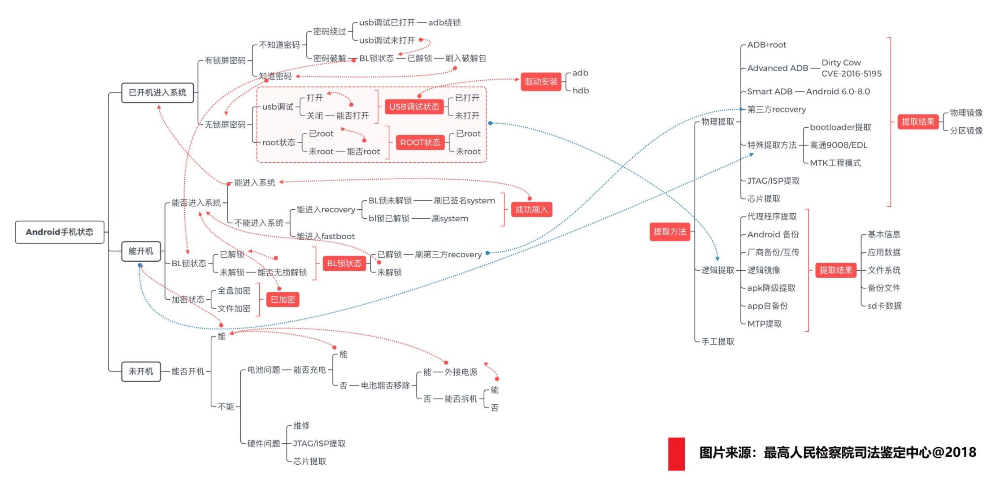

# 取证笔记

---

## 免责声明

`本人撰写的手册,仅供学习和研究使用,请勿使用文中的技术源码用于非法用途,任何人造成的任何负面影响,与本人无关.`

---

# 大纲

**[操作系统取证](#操作系统取证)**
* [Android](#Android)
* [win](#win)
* [Linux](#Linux)

**[文件-软件取证](#文件-软件取证)**
* [exif](#exif)
* [浏览器取证](#浏览器取证)

**[WEB取证](#WEB取证)**
* [中间件服务器程序日志](#中间件服务器程序日志)

**[网络取证](#网络取证)**

**[数据库取证](#数据库取证)**
* [mysql](#mysql)
* [mssql](#mssql)
* [Oracle](#Oracle)

---

# 操作系统取证

## Android



## win

**工具**
- [The Sleuth Kit (TSK)](https://www.sleuthkit.org/) - 一套强大的数字调查、取证工具集合

**windows 日志**

> 开始->运行->输入 eventvwr

事件类型	| 描述	| 文件名
- | - | -
系统 | 系统日志包含 Windows 系统组件记录的事件。例如，在启动过程中加载驱动程序或其他系统组件失败将记录在系统日志中。系统组件所记录的事件类型由 Windows 预先确定。 | %SystemRoot%\System32\Winevt\Logs\System.evtx
安全 | 安全日志包含诸如有效和无效的登录尝试等事件，以及与资源使用相关的事件，如创建、打开或删除文件或其他对象。管理员可以指定在安全日志中记录什么事件。例如，如果已启用登录审核，则对系统的登录尝试将记录在安全日志中。 | 	%SystemRoot%\System32\Winevt\Logs\Security.evtx
应用程序 | 应用程序日志包含由应用程序或程序记录的事件。例如，数据库程序可在应用程序日志中记录文件错误。程序开发人员决定记录哪些事件。 | %SystemRoot%\System32\Winevt\Logs\Application.evtx
转发事件 | ForwardedEvents 日志用于存储从远程计算机收集的事件。若要从远程计算机收集事件，必须创建事件订阅。	| %SystemRoot%\System32\Winevt\Logs\ForwardedEvents.evtx

Windows 的日志以事件 id 来标识具体发生的动作行为，可通过下列网站查询具体 id 对应的操作
- https://docs.microsoft.com/en-us/windows/security/threat-protection/ 直接搜索 event + 相应的事件id 即可
- https://www.ultimatewindowssecurity.com/securitylog/encyclopedia/default.aspx?i=j

**DNS**
- 工具
    - [dnsdataview](https://www.nirsoft.net/utils/dns_records_viewer.html) - 记录 DNS 记录

**动作记录**
- 工具
    - [Device Cleanup Tool](https://www.uwe-sieber.de/misc_tools_e.html) – 查看电脑连接过的设备
    - [LastActivityView](https://www.nirsoft.net/utils/computer_activity_view.html) – 最近你干什么了
    - [OpenSaveFilesView](https://www.nirsoft.net/utils/open_save_files_view.html) – 显示文件打开、保存记录
    - [TurnedOnTimesView](https://www.nirsoft.net/utils/computer_turned_on_times.html) – 快速查看系统开关机时间
    - [uknowsec/loginlog_windows](https://github.com/uknowsec/loginlog_windows) - 读取登录过本机的登录失败或登录成功的所有计算机信息

**key**
- 本部分见 [口令获取及破解](../../Power-Pentest.md#口令获取及破解)

**蓝牙**
- 工具
    - [bluetoothview](https://www.nirsoft.net/utils/bluetooth_viewer.html) - 监控周围的蓝牙设备

**无线**
- 工具
    - [wifihistoryview](https://www.nirsoft.net/utils/wifi_history_view.html) - Wi-Fi 连接历史记录
    - [wirelesskeyview](https://www.nirsoft.net/utils/wireless_key.html)- 查看本地 wifi 密码

## Linux

- [日志](../../../运维/Linux/笔记/日志.md)
- [Linux基本信息查询命令](../../../运维/Linux/笔记/信息.md)
- [Linux加固+维护+应急响应参考](../../../运维/Linux/Secure-Linux.md)

---

# 文件-软件取证

## exif

**工具**
- [ExifTool](https://www.sno.phy.queensu.ca/~phil/exiftool/) - 用于读取，写入和编辑各种文件中的 exif 信息的工具

## 浏览器取证

**工具**
- [obsidianforensics/hindsight](https://github.com/obsidianforensics/hindsight) - chrome历史访问记录取证工具(真是不给人留条活路)
- [x899/chrome_password_grabber](https://github.com/x899/chrome_password_grabber) - 从 Chrome 获取未加密的“保存的密码”
- [m0rv4i/SharpCookieMonster](https://github.com/m0rv4i/SharpCookieMonster) - 从 Chrome 中提取 cookie

---

# WEB取证

**文章**
- [比敌人更了解敌人 [ 取证入门 web篇 ]](https://www.freebuf.com/column/147929.html)

## 中间件服务器程序日志

部分内容来自项目 https://github.com/theLSA/emergency-response-checklist 和 Tide 团队安全文章

**IIS**

`C:\WINDOWS\system32\LogFiles` : 日志内容包括访问域名时间、ip、访问 url 等信息。

**httpd**
- `/etc/httpd/logs/`

**apache**

apache 日志一般分为 `access_log` 和 `error_log` 两种，通过查看 `httpd.conf` 文件查看 apache 日志路径：
```bash
grep -i "CustomLog" /etc/httpd/conf/httpd.conf
grep -i "ErrorLog" /etc/httpd/conf/httpd.conf
```
- Linux : `/usr/local/apache/logs/`
- Linux : `/var/log/apache2`
- Windows : `apache/logs/`
- `access_log` : 访问日志,记录所有对 apache 服务器进行请求的访问
- `error_log` : 错误日志,记录下任何错误的处理请求，通常服务器出现什么错误，可对该日志进行查看

**nginx**

nginx 的日志主要分为 `access.log`、`error.log` 两种，可通过查看 `nginx.conf` 文件来查找相关日志路径
- `access.log` : 主要记录访问日志，记录访问客户端ip地址、访问时间、访问页面等信息。
- `error.log` : 主要记录一些错误信息。

**tomcat**

tomcat 日志默认路径：在安装目录下的 logs 文件夹下
- 如果在安装中默认修改了日志存储位置，可在 `conf/logging.properties` 文件中查看
- `catalina.out` : 运行中的日志，主要记录运行中产生的一些信息，尤其是一些异常错误日志信息
- `catalina.Y-M-D.log` : 是 tomcat 自己运行的一些日志，这些日志还会输出到 `catalina.out`，但是应用向 console 输出的日志不会输出到 `catalina.{yyyy-MM-dd}.log`
- `host-manager.xx.log` : 管理日志
- `localhost.xx.log` : 程序异常没有被捕获的时候抛出的地方，Tomcat 下内部代码丢出的日志(jsp 页面内部错误的异常，`org.apache.jasper.runtime.HttpJspBase.service` 类丢出的，日志信息就在该文件!)应用初始化(listener,filter, servlet)未处理的异常最后被 tomcat 捕获而输出的日志，而这些未处理异常最终会导致应用无法启动。
- `manager.xx.log`
- `localhost_access_log` : 主要记录访问日志信息，记录访问的的时间、ip 地址等信息，也是应急中经常用到的日志信息

**weblogic**

weblogic 在安装结束后默认开启了日志记录功能，默认配置情况下，weblogic 会有3种日志，分别是 `accesslog`, `Server log` 和 `domain log`，WebLogic8.x 和 9 及以后的版本目录结构有所不同。

- `domain_name/servers/server_name/logs/`
- `$MW_HOME` 是 WebLogic 的安装目录
- `<domain_name>` 是域的实际名称，是在创建域的时候指定的
- `<server_name>` 是 Server 的实际名称，是在创建 Server 的时候指定的
- `<adminserver_name>` 是 Admin Server 的实际名称，是在创建 Admin Server 的时候指定的。

WebLogic 9及以后版本：
- `domain log` : 主要记录了一个 domain 的运行情况，一个 domain 中的各个 weblogic server 可以把它们的一些信息（如：严重错误）发送到 AdminServer 上，AdminServer 把这些信息传递到 domain.log 上.
    ```
    $MW_HOME\user_projects\domains\<domain_name>\servers\<adminserver_name>\logs\<domain_name>.log
    ```
- `server log` : 主要用于服务器的一般日志记录，比如 weblogic 的启动、关闭、部署应用等相关记录，日志格式：依次为时间戳，严重程度，子系统，计算机名，服务器名，线程 ID.
    ```
    $MW_HOME\user_projects\domains\<domain_name>\servers\<server_name>\logs\<server_name>.log
    ```
- `access log` : 主要记录 http 请求，默认情况下日志记录处于启用状态，服务器将 http 请求保存在单独的日志文件中，日志主要记录了 http 请求请求 ip 地址、请求时间、访问页面、响应状态等信息.
    ```
    $MW_HOME\user_projects\domains\<domain_name>\servers\<server_name>\logs\access.log
    ```

WebLogic 8.x版本:
- `access log`
    ```
    $MW_HOME\user_projects\domains\<domain_name>\<server_name>\access.log
    ```
- `server log`
    ```
    $MW_HOME\user_projects\domains\<domain_name>\<server_name>\<server_name>.log
    ```
- `domain log`
    ```
    $MW_HOME\user_projects\domains\<domain_name>\<domain_name>.log
    ```

**jboss**
- LOG4J 配置默认 `Deploy/conf/` 如 `jboss/server/default/conf/jboss-log4j.xml`

---

# 网络取证

**工具**
- [wireshark](../../Power-Pentest.md#抓包工具)
- 火绒剑
- [process monitor](https://docs.microsoft.com/en-us/sysinternals/downloads/procmon)
- [科来网络分析系统](http://www.colasoft.com.cn/download.php)

---

# 数据库取证

下列部分内容来自项目 https://github.com/theLSA/emergency-response-checklist 和 Tide 团队安全文章

**misc**
- `mysql\lib\plugin` 目录的异常文件
- select * from mysql.func 的异常
- mssql 检查 xp_cmdshell 等存储过程
- 异常数据库登录
- 数据库用户弱口令
- 注意 mysqld 配置文件

## mysql

**mysql 日志**
- 错误日志：默认开启，hostname.err
- 查询日志：记录用户的所有操作。默认关闭，general_log_file（常见 getshell 手法）
- 慢查询日志：记录执行时间超过指定时间的查询语句，slow_query_log_file（慢查询 getshell）
- 事务日志：ib_logfile0
- 二进制日志：记录修改数据或有可能引起数据改变的 mysql 语句，log_bin，默认在数据目录，如 mysql-bin.000001
- `ErrorLog` : 记录 Mysql 运行过程中的 Error、Warning、Note 等信息，系统出错或者某条记录出问题可以查看 Error 日志；
- `GenaralQuery Log` ：记录 mysql 的日常日志，包括查询、修改、更新等的每条 sql；
- `Binary Log` ：二进制日志，包含一些事件，这些事件描述了数据库的改动，如建表、数据改动等，主要用于备份恢复、回滚操作等；
- `Slow QueryLog*` ：记录 Mysql 慢查询的日志；
- mysql 相关命令
    ```sql
    status;
    show global variables like '%log%';
    show global variables like '%gene%';
    show master status;
    systemmore /mydata/data/stu18_slow.log;
    showbinary logs;
    showmaster logs;
    showbinlog events in 'mysql-bin.000011';
    show processlist;
    ```
- 更多 mysql 日志类型可参考 https://www.jianshu.com/p/db19a1d384bc

## mssql

**mssql 日志**

SQL Server 日志记录了完整的 SQL Server 数据库运行的状态信息，并以消息的形式记录系统级、应用级操作。

可以使用 SQL Server Management Studio 中的日志文件查看器来访问有关在以下日志中捕获的错误和事件的信息：

SQL Server Management Studio 连接 sqlserver 数据库，查看与常规 SQL Server 活动相关的日志。

- exec xp_readerrorlog
- object Explorer-Management-SQL Server logs-view-logs
- SQL Server 2008： R2\MSSQL10_50.MSSQLSERVER\MSSQL\Log\ERRORLOG
- 查询最近一次启动 sqlserver 时间：
    ```sql
    select sqlserver_start_time fromsys.dm_os_sys_info;
    ```
- 历史 sql 记录查询：SQLServer 并没有这样的实现，只有 `sys.dm_exec_query_stats` 缓存了一部分 (sql server 服务开启后执行的语句，某些不被缓存执行计划的语句并不记录)。
- Sqlserver 开启日志审计功能可参考 https://blog.51cto.com/gaowenlong/1908381

## Oracle

**Oracle 日志**

Oracle 日志文件分为两种：重做日志文件（redo log file）、归档日志文件，其中重做日志文件主要记录了数据库的操作过程，可以在进行数据库恢复时，将重做日志文件在还原的数据库上进行执行，以达到数据库的最新状态。

Oracle 数据库默认只是对数据库的登录情况记录，但是不对数据库的查询记录统计，可通过 `show parameter audit`，查看审计功能是否开启，若 audit_sys_operations 值为 DB。

开启审计功能
```
alter system set audit_sys_operations=TRUEscope=spfile;
alter system set audit_trail=db,extendedscope=spfile;
```
重启实例即可,开启后会把审计内容记录到 sys 库的 AUD$ 表中
