# 工控协议

---

## 免责声明

`本人撰写的手册,仅供学习和研究使用,请勿使用文中的技术源码用于非法用途,任何人造成的任何负面影响,与本人无关.`

---

# S7Comm

**简介**

S7Comm（S7 Communication）是西门子专有的协议，是西门子 S7 通讯协议簇里的一种。

S7 协议的 TCP/IP 实现依赖于面向块的 ISO 传输服务。S7 协议被封装在 TPKT 和 ISO-COTP 协议中，这使得 PDU（协议数据单元）能够通过 TCP 传送。

它用于 PLC 编程，在 PLC 之间交换数据，从 SCADA（监控和数据采集）系统访问 PLC 数据以及诊断目的。

S7Comm 以太网协议基于 OSI 模型：

| layer | Protocol |
| - | - |
| 7 Application Layer 	| S7 communication |
| 6 Presentation Layer 	| S7 communication |
| 5 Session Layer 	    | S7 communication |
| 4 Transport Layer 	| ISO-on-TCP (RFC 1006) |
| 3 Network Layer 	    | IP |
| 2 Data Link Layer 	| Ethernet |
| 1 Physical Layer 	    | Ethernet |

从 wireshark 协议分级可以看出排列

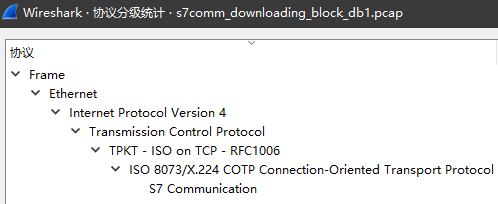

TPKT，应用层数据传输协议，介于 TCP 和 COTP 协议之间。这是一个传输服务协议，主要用来在 COTP 和 TCP 之间建立桥梁；

COTP，按照维基百科的解释，COTP 是 OSI 7 层协议定义的位于 TCP 之上的协议。COTP 以“Packet”为基本单位来传输数据，这样接收方会得到与发送方具有相同边界的数据；

第7层，S7 communication，这一层和用户数据相关，对 PLC 数据的读取报文在这里完成。

在具体的报文中，TPKT 的作用是包含用户协议（5~7层）的数据长度（字节数）；COTP 的作用是定义了数据传输的基本单位（在S7Comm中 PDU TYPE：DT data）。

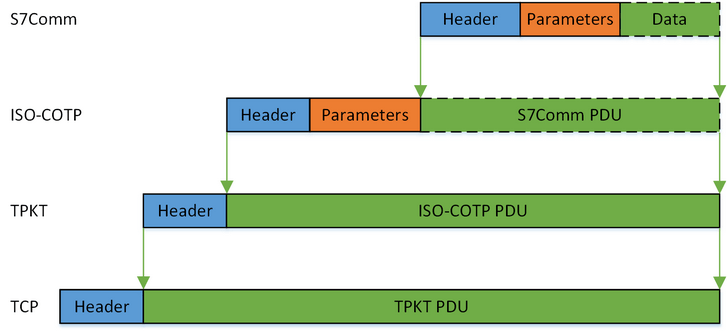

S7Comm 数据作为 COTP 数据包的有效载荷，第一个字节总是 0×32 作为协议标识符。

S7Comm 协议包含三部分：
- Header
- Parameter
- Data

根据实现的功能不同，S7 comm 协议的结构会有所不同。

---

## S7Comm Header

S7Comm 的头，定义了该包的类型、参数长度、数据长度等，其结构如图所示：

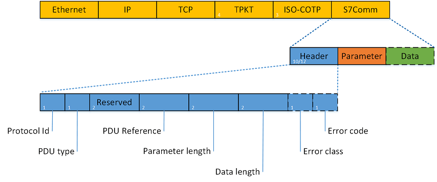

所以，S7Comm Header的格式为：
- 0 (unsigned integer, 1 byte): Protocol Id，协议 ID，通常为 0×32；
- 1 (unsigned integer, 1 byte): ROSCTR，PDU type，PDU 的类型，一般有以下值：
    - 0×01 – JOB(Request： job with acknowledgement)：作业请求。由主设备发送的请求（例如，读/写存储器，读/写块，启动/停止设备，设置通信）；
    - 0×02 – ACK(acknowledgement without additional field)：确认响应，没有数据的简单确认（未遇到过由 S7 300/400 设备发送得）；
    - 0×03 – ACK_DATA(Response： acknowledgement with additional field)：确认数据响应，这个一般都是响应JOB的请求；
    - 0×07 – USERDATA：原始协议的扩展，参数字段包含请求/响应 ID（用于编程/调试，读取 SZL，安全功能，时间设置，循环读取…）。
- 2~3 (unsigned integer, 2 bytes): Redundancy Identification (Reserved)，冗余数据，通常为 0×0000；
- 4~5 (unsigned integer, 2 bytes): Protocol Data Unit Reference，it’s increased by request event。协议数据单元参考，通过请求事件增加；
- 6~7 (unsigned integer, 2 bytes): Parameter length，the total length (bytes) of parameter part。参数的总长度；
- 8~9 (unsigned integer, 2 bytes): Data length，数据长度。如果读取 PLC 内部数据，此处为 0×0000；对于其他功能，则为 Data 部分的数据长度；

其中最重要的字段就是 ROSCTR，它决定了后续参数的结构

在响应数据包中，还有可能存在错误信息，其错误信息结构为：

- 10 (unsigned integer, 1 bytes): Error class，错误类型：
- 11 (unsigned integer, 1 bytes): Error code，错误代码；

---

## Job 和 Ack_Data

S7Comm 中 Job(作业请求) 和 Ack_Data(确认数据响应) 中的 Parameter 项的第一个字段是 function（功能码），其类型为 Unsigned integer，大小为 1 byte。决定了其余字段的结构、消息的目的。

- **建立通信（Setup communication [0xF0]）**

    建立通信在每个会话开始时被发送，然后可以交换任何其他消息。它用于协商 ACK 队列的大小和最大 PDU 长度，双方声明它们的支持值。ACK 队列的长度决定了可以同时启动而不需要确认的并行作业的数量。PDU 和队列长度字段都是大端。

    当 PDU 类型为 Job 时，建立通信功能中 Parameter 的结构，如下图：

    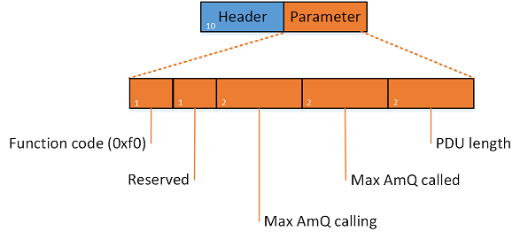

    具体的 Parameter 结构，如下：
    - 1 (Unsigned integer, 1 byte): Parameter part: Reserved byte in communication setup pdu，保留字节；
    - 2 (Unsigned integer, 2 bytes): Max AmQ (parallel jobs with ack) calling；
    - 3 (Unsigned integer, 2 bytes): Max AmQ (parallel jobs with ack) called；
    - 4 (Unsigned integer, 2 bytes): Parameter part: Negotiate PDU length。协商 PDU 长度。

- **读取值（Read Var [0x04]）**

    数据读写操作通过指定变量的存储区域，地址（偏移量）及其大小或类型来执行。

    当 PDU 类型为 Job 时，那么其 S7Comm 结构，如下图：

    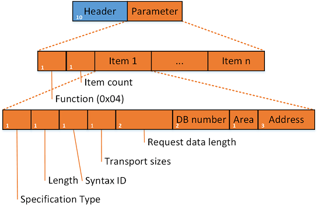

    所以，接下来的 Parameter 字段是 item count（项目个数），其类型为 Unsigned integer，大小为 1 byte。

    item的结构如下：
    - 0 (Unsigned integer, 1 byte): Variable specification，确定项目结构的主要类型，通常为 0×12，代表变量规范；
    - 1 (Unsigned integer, 1 byte): Length of following address specification，本 Item 其余部分的长度；
    - 2 (Unsigned integer, 1 byte): Syntax Ids of variable specification，确定寻址模式和其余项目结构的格式；
    - 3(Unsigned integer, 1 byte): Transport sizes in item data，确定变量的类型和长度：
    - 4~5 (Unsigned integer ,2 byte): Request data length，请求的数据长度；
    - 6~7 (Unsigned integer, 2 byte): DB number，DB 模块的编号，如果访问的不是 DB 区域，此处为 0×0000；
    - 8 (Unsigned integer, 1 byte)：: Area，区域类型：
    - 9~11(Unsigned integer, 3 byte): Address，地址。

    PDU 类型为 Ack_Data 时，其 S7Comm 的结构，如下图：

    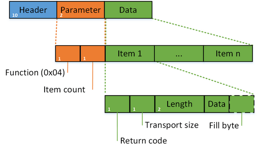

    其 Parameter 只有 function、item count 两个字段。Data 结构如下：
    - 0 (Unsigned integer, 1 byte): Return code，返回代码：
    - 1 (Unsigned integer, 1 byte): Transport size，数据的传输尺寸：
    - 2~3 (Unsigned integer, 2 bytes): Length，数据的长度；
    - 4~4+length (?): Data，数据；
    - ? (Unsigned integer, 1 byte): Fill byte，填充字节。

- **写入值（Write Var [0x05]）**

    Write Var 中 Parameter 的结构跟读取值（Read Var[0x04]）一样，但是 Write Var 还需写入值，所以 Write Var 比 Read Var 多了一个 Data 项。结构如下：

    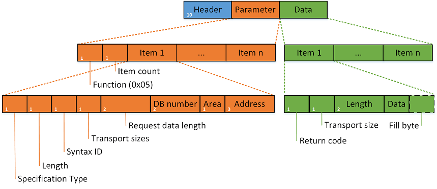

    由此，Data 的结构为：
    - 0 (Unsigned integer, 1 byte): Return code，返回代码，这里是未定义，所以为 Reserved（0×00）；
    - 1 (unsigned integer, 1 byte): Transport size，确定变量的类型和长度：
    - 2-3 (unsigned integer, 2 bytes): Length，写入值的数据长度；
    - 4 (1 byte): Data，写入的值；
    - 5 (unsigned integer, 1 byte): Fill byte，填充字节，如果数据的长度不足 Length 的话，则填充；

    PDU 类型为 Ack_Data 时，其 S7Comm 的结构，如下图：

    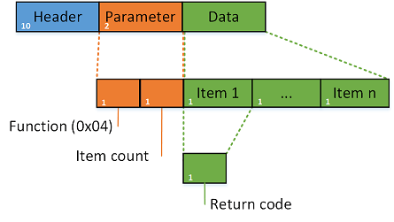

    Parameter 也只有 function、item count 两个字段。而 Data 中也只有一个 Return code 字段，其结构如下：
    - 0 (Unsigned integer, 1 byte): Return code，返回代码：

- **下载**

    下载是 Step7 发送块数据给 PLC。在西门子设备上，程序代码和（大部分）程序数据存储在块中，这些块有自己的头和编码格式。

    在西门子设备中有8种不同类型的功能块，这些块在上/下载请求中用特殊的ASCII文件名寻址。这个文件名的结构如下：

    - 1 (1 byte): File identifier（ASCII），文件标识符。其有_ (Complete Module)、$ (Module header for up-loading)两种文件标识符；
    - 2 (2 bytes): Block type，块类型。
    - 3 (5 bytes): Block number，块编号；
    - 4 (1 byte): Destination filesystem(ASCII)，目标的文件系统。其有三种文件系统：
        - P (Passive (copied, but not chained) module)：被动文件系统
        - A (Active embedded module)：主动文件系统
        - B (Active as well as passive module)：既主既被文件系统

    例如：文件名为_0A00001P（文件标识是_，块类型为DB，块的编号为00001，目标块的文件系统是P。），用于将DB 1复制到被动文件系统或从被动文件系统复制。

    在下载过程中，先是 Step7 向 PLC 发送一个请求下载的 Job，PLC 收到后则回复一个 Ack_Data。在发送完所有字节后，Step7 向 PLC 发送一个下载结束的 Job 来关闭下载会话。时序图如下

    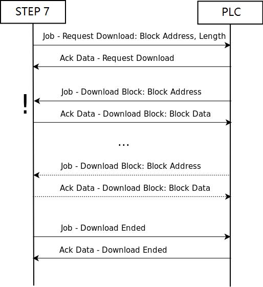

    下载有3种不同的功能类型：
    - 请求下载（Request download [0x1A]）

        当 PDU 类型为 Job 时，Request download [0x1A] 没有 Data，其 Parameter 的结构，如下
        - 1 (1 byte): Function Status，功能码状态；
        - 2 (2 bytes): for all unknown bytes in blockcontrol；
        - 3 (4 bytes): 无意义，一般为0x00000000；
        - 4 (1 byte): filename length，文件名长度；
        - 5 (? bytes): filename, default is 9 byte，文件名，长度一般为9个字节；
            - 1 (1 byte): File identifier（ASCII），文件标识符。其有_ (Complete Module)、$ (Module header for up-loading)两种文件标识符；
            - 2 (2 bytes): Block type，块类型。
            - 3 (5 bytes): Block number，块编号；
            - 4 (1 byte): Destination filesystem（ASCII），目标的文件系统。其有P（Passive (copied, but not chained) module)、A (Active embedded module)、B (Active as well as passive module)三种文件系统；
        - 6 (1 byte): Length part 2 in bytes，参数的第二部分长度，也就是接下来的字段长度；
        - 7 (1 byte): Unknown char（ASCII）；
        - 8 (6 bytes): Length load memory in bytes（ASCII）；
        - 9 (6 bytes): Length of MC7 code in bytes（ASCII）。

        PDU 类型为 Ack_Data 时，Request download [0x1A] 的 Parameter 中只有一个 function。

    - 下载块（Download block [0x1B]）

        下载是 Step7 发送块数据给 PLC。当 PDU 类型为 Job 时，Download block [0x1B] 也没有 Data，其 Parameter 的结构，如下
        - 1 (1 byte): Function Status，功能码状态；
        - 2 (2 bytes): for all unknown bytes in blockcontrol；
        - 3 (4 bytes): 无意义，一般为0x00000000；
        - 4 (1 byte): filename length，文件名长度；
        - 5 (? bytes): filename, default is 9 byte，文件名，长度一般为9个字节；
            - 1 (1 byte): File identifier（ASCII），文件标识符。其有_ (Complete Module)、$ (Module header for up-loading)两种文件标识符；
            - 2 (2 bytes): Block type，块类型。
            - 3 (5 bytes): Block number，块编号；
            - 4 (1 byte): Destination filesystem（ASCII），目标的文件系统。其有P（Passive (copied, but not chained) module)、A (Active embedded module)、B (Active as well as passive module)三种文件系统；

        Download block [0x1B] 的 Parameter 与 Request download [0x1A] 的 Parameter 的第一部分相同

        那 PDU 类型为 Ack_Data 时，Download block [0x1B] 有 Parameter 和 Data，其 Parameter 的结构，如下
        - 1 (1 byte): Function Status，功能码状态；
            - 1 (Unsigned integer, 2 bytes): Length，数据长度；
            - 2 (Unsigned integer, 2 bytes): Unknown byte(s) in blockcontrol，未知字节；
            - 3 (Label，data_length-4 bytes): Data，数据；

    - 下载结束（Download ended [0x1C]）

        当 PDU 类型为 Job 时，Download ended [0x1C] 也没有 Data，其 Parameter 的结构，如下：
        - 1 (1 byte): Function Status，功能码状态；
        - 2 (2 bytes): for all unknown bytes in blockcontrol；
        - 3 (4 bytes): 无意义，一般为 0x00000000；
        - 4 (1 byte): filename length，文件名长度；
        - 5 (? bytes): filename, default is 9 byte，文件名，长度一般为9个字节；
            - 1 (1 byte): File identifier（ASCII），文件标识符。其有_ (Complete Module)、$ (Module header for up-loading)两种文件标识符；
            - 2 (2 bytes): Block type，块类型。
            - 3 (5 bytes): Block number，块编号；
            - 4 (1 byte): Destination filesystem（ASCII），目标的文件系统。其有P（Passive (copied, but not chained) module)、A (Active embedded module)、B (Active as well as passive module)三种文件系统；

        PDU 类型为 Ack_Data 时，Download ended [0x1C] 的 Parameter 中只有一个 function。

- **上传**

    上传是 PLC 发送块数据给 Step7

    在上传过程中，先是 Step7 向 PLC 发送一个开始上传的 Job，PLC 收到后则回复一个 Ack_Data，并告诉 Step7 块的长度、上传会话 ID。然后 PLC 继续上传块数据到 Step7，直到 Step7 收到所有字节。最后，Step7 发送结束上传的作业请求来关闭上传会话。时序图如下

    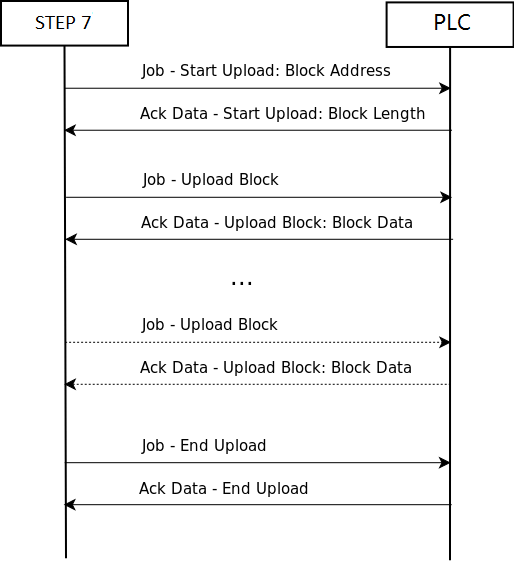

    上传有3种不同的功能类型
    - 开始上传（Start upload [0x1D]）

        当 PDU 类型为 Job 时，Start upload [0x1D] 没有 Data，其 Parameter 的结构，如下
        - 1 (1 byte): Function Status，功能码状态；
        - 2 (2 bytes): for all unknown bytes in blockcontrol；
        - 3 (4 bytes): 上传的会话ID，此时为0x00000000；
        - 4 (1 byte): filename length，文件名长度；
        - 5 (? bytes): filename, default is 9 byte，文件名，长度一般为9个字节；
            - 1 (1 byte): File identifier（ASCII），文件标识符。其有_ (Complete Module)、$ (Module header for up-loading)两种文件标识符；
            - 2 (2 bytes): Block type，块类型。
            - 3 (5 bytes): Block number，块编号；
            - 4 (1 byte): Destination filesystem（ASCII），目标的文件系统。其有P（Passive (copied, but not chained) module)、A (Active embedded module)、B (Active as well as passive module)三种文件系统；

        那 PDU 类型为 Ack_Data 时，Start upload [0x1D] 的 Parameter 的结构，如下
        - 1 (1 byte): Function Status，功能码状态；
        - 2 (2 bytes): for all unknown bytes in blockcontrol；
        - 3 (4 bytes): 上传的会话ID，告诉Step7上传会话ID；
        - 4 (Unsigned integer, 1 byte): Blocklengthstring Length；
        - 5 (Character string): Blocklength，块的长度；

    - 上传（Upload [0x1E]）

        当 PDU 类型为 Job 时，Upload [0x1E] 也没有 Data，其 Parameter 的结构，如下
        - 1 (1 byte): Function Status，功能码状态；
        - 2 (2 bytes): for all unknown bytes in blockcontrol；
        - 3 (4 bytes): 上传的会话ID，告诉Step7上传会话ID；

        PDU 类型为 Ack_Data 时，Upload [0x1E] 有 Parameter 和 Data，其 Parameter 的结构，如下
        - 1 (1 byte): Function Status，功能码状态；
            - 1 (Unsigned integer, 2 bytes): Length，数据长度；
            - 2 (Unsigned integer, 2 bytes): Unknown byte(s) in blockcontrol，未知字节；
            - 3 (Label，data_length-4 bytes): Data，数据；

    - 上传结束（End upload [0x1F]）

        上传结束的过程，即为所有数据上传完成后，Step7 发送结束上传的作业请求，PLC 收到后就关闭会话，然后返回一个响应。

        当 PDU 类型为 Job 时，End upload [0x1F] 也没有 Data，其 Parameter 的结构，如下
        - 1 (1 byte): Function Status，功能码状态；
        - 2 (2 bytes): Error code，错误代码：
        - 3 (4 bytes): 上传的会话ID，告诉 Step7 上传会话 ID；

        那 PDU 类型为 Ack_Data 时，End upload [0x1F] 的 Parameter 中只有一个 function。

- **程序调用服务（PI service [0x28]）**

    程序调用是用于在 PLC 执行修改执行/内存状态的日常工作。这些命令可以用于启动或停止 PLC 控制程序、激活或删除程序块。

    当 PDU 类型为 Job 时，PI service [0x28] 没有 Data，只有 Parameter，那 Parameter 的结构，如下：
    - 1 (7 bytes): Unknown；
    - 2 (Unsigned integer, 2 bytes): Parameter block length；
    - 3 (?bytes): Parameter block，参数；
    - 4 (Unsigned integer, 1 byte):String length，PI service的字符串长度；
    - 5 (Character string, ASCII):PI (program invocation) Service name，程序调用服务名。

    Parameter 包含两个主要部分：
    - 服务名称
    - 参数：取决于方法类型，可以将它们看作是它的参数

    服务名称及其相关参数的示例：
    - _INSE：激活设备上下载的块，参数是块的名称（比如：OB 1）。
    - _DELE：从设备的文件系统中删除一个块，该参数也是该块的名称。
    - P_PROGRAM：设置设备的运行状态（启动、停止、复位）。
    - _GARB：压缩 PLC 内存。
    - _MODU：将 ram 复制到 ROM，参数包含文件系统标识符（A/E/P）。

    如果服务调用的参数是块的话，那么 Parameter block 的结构如下：
    - 1 (1 byte): Number of block；
    - 2 (1 byte): Unknown，默认为 0x00；
    - 3 (? bytes): filename，文件名：
    - 1 (2 bytes, ASCII): Block type，块类型。
    - 2 (5 bytes, ASCII): Block number，块编号；
    - 3 (1 byte, ASCII): Destination filesystem（ASCII），目标的文件系统。其有 P(Passive (copied, but not chained) module)、A (Active embedded module)、B (Active as well as passive module)三种文件系统；

- **PLC STOP [0x29]**

    PLC STOP 基本上跟程序调用服务（PI service [0x28]）一致，唯一的区别就是它没有 Parameter block，而它的 PI service 为 P_PROGRAM。

---

## Userdata 协议拓展

UserData 用于编程/调试、读取 SZL、安全功能、时间设置，循环读取等

Parameter 结构如下
- 1 (3 bytes)：参数头（Parameter head）；
- 2 (1 byte)：参数长度（Parameter length），它的可能是8字节或12字节；
- 3 (1 byte)：未知定义；
- 4 (1/2 byte，高位)：参数类型（Type）；
- 5 (1/2 byte，Low nibble)：功能组（Function group）；
- 6 (1 byte)：子功能码（SubFunction）；
- 7 (1 byte)：序号。

当 PDU 类型为 UserData 时，其 S7Comm 结构，如图所示,图中蓝色部分为 S7Comm 头部，橘色为 Parameter 部分.

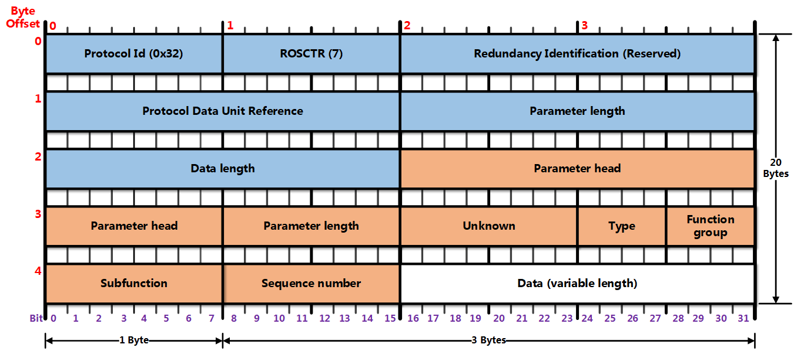

- **转换工作模式（Mode-transition [0x0]）**

    当功能组为转换工作模式（Mode-transition）时，请求报文中是没有 Data 部分的，而主要起作用的是子功能码（Subfunction），常见的子功能码有：
    - STOP（0x00）：STOP 模式；
    - Warm Restart（0x01）：暖启动；
    - RUN（0x02）：RUN 模式；
    - Hot Restart（0x03）：热启动；
    - HOLD（0x04）：HOLD 模式；
    - Cold Restart（0x06）：冷启动；
    - RUN_R (H-System redundant)（0x09）：H-System 冗余运行；
    - LINK-UP（0x0B）：LINK-UP 模式；
    - UPDATE（0x0C）：UPDATE 模式。

- **程序员命令（Programmer commands [0x1]）**

    程序员命令（Programmer commands）主要是工程师用于编程或调试，比如：监视/修改变量、读取修改诊断数据。所有的子功能码有：
    - 请求诊断数据（Request diag data (Type 1)）：0x01;
    - 变量表（VarTab）：0x02;
    - 读取诊断数据（Read diag data）：0x0c;
    - 移除诊断数据（Remove diag data）：0x0e;
    - 清除（Erase）：0x0f;
    - 强制（Forces）：0x10;
    - 请求诊断数据（Request diag data (Type 2)）：0x13;

    请求报文和响应报文，如图所示

    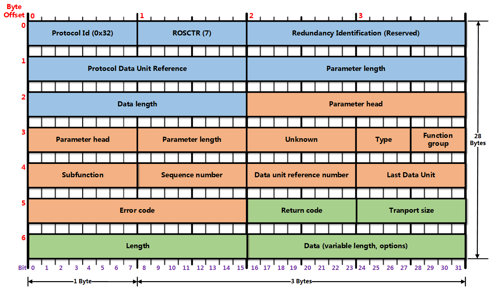

    请求报文的结构如下：
    - 1 (1 byte) : 返回码；
    - 2 (1 byte) :Transport sizes，指的数据类型，通常有 bit、byte等；
    - 3 (2 bytes) : 往后的数据长度；
    - 4 (1 byte) : Unknown；
    - 5 (1 byte) : 报文类型（type of data），分为请求（0x14）、响应（0x04）；
    - 6 (2 bytes) : Item count和Item data的长度（Byte count）；
    - 7 (20bytes) : Unknown；
    - 8 (2bytes) : Item 个数；
    - 9 (varibalebytes) : Item 1；
        - 1 (1 byte) : 区域（Area）;
        - 2 (1 byte) : 长度（Length (repetition factor)）；
        - 3 (2 bytes) : 模块号（DB number）;
        - 4 (2 bytes) : 偏移地址（Startaddress）。
    - n (varibalebytes) : Item n；

    响应报文结构如下:
    - 1 (1 byte) : 返回码；
    - 2 (1 byte) :数据类型（Transport sizes），通常有 bit、byte 等；
    - 3 (2 bytes) : 往后的数据长度；
    - 4 (1 byte) : Unknown；
    - 5 (1 byte) : 报文类型（type of data），分为请求（0x14）、响应（0x04）；
    - 6 (2 bytes) : Item count 和 Item data 的长度（Byte count）；
    - 7 (4bytes) : Unknown；
    - 8 (2bytes) : Item 个数；
    - 9 (varibalebytes) : Item 1；
    - 1 (1 byte) : 返回码；
    - 2 (1 byte) :数据类型（Transport sizes），通常有 bit、byte 等；
    - 3 (2 bytes) : 往后的数据长度；
    - 4 (varibale bytes) : Data。
    - n (varibalebytes) : Item n；

- **循环数据（Cyclic data [0x2]）**

    循环数据（Cyclic data）是用于循环读取内存数据、取消订阅循环数据，比如：DB、M 等。所有的子功能码有：

    - 0x01：读取内存数据（Memory），比如 DB、M 等；
    - 0x04：取消订阅或禁用循环数据（Unsubscribe (disable) cyclic data）；
    - 0x05：读取内存数据（Memory），跟 0x01 一样，但仅用于 S7-400。

    请求报文的 Data 结构如下：
    - 1 (1 byte) : 返回码（return code）；
    - 2 (1 byte) : 数据传输大小（Transport sizes），通常有 bit、byte 等；
    - 3 (2 bytes) : 以此往后的数据长度；
    - 4 (2 bytes) : Item 个数；
    - 5 (1byte) : 扫描间隔（Interval timebase）；
    - 6 (1byte) : 时间间隔（Interval timebase）；
    - 7 (varibale bytes) : Item 1；
        - 1 (1 byte) : Variable specification;
        - 2 (1 byte) : 以下规范地址的长度（Length of following address specification）；
        - 3 (1 byte) : Syntax Id;
        - ...（不同的 Syntax Id，则结构不一样。）
    - ...
    - n (varibale bytes) : Item n；

    响应报文的 Data 结构如下：
    - 1 (1 byte) : 返回码（return code）；
    - 2 (1 byte) : 数据传输大小（Transport sizes）；
    - 3 (2 bytes) : 以此往后的数据长度；
    - 4 (2 bytes) : Item 个数；
    - 5 (varibale bytes) : Item 1；
        - 1 (1 byte) : 返回码（return code）；
        - 2 (1 byte) : 数据传输大小（Transport sizes）；
        - 3 (2 bytes) : 以此往后的数据长度；
        - 4 (varibale bytes) : 数据；
    - ...
    - n (varibale bytes) : Item n；

- **块功能（Block functions [0x3]）**

    块功能（Block functions）是用于操作块，所有的子功能码有：
    - 0x01：列举所有块（List blocks）；

        在 PLC 中有各种块，比如 DB、OB、FB，可以通过 block functions 中的子功能码 list blocks 进行块的列举

        请求报文的 Data 结构如下：
        - 1 (1 byte) : 返回码（return code）；
        - 2 (1 byte) : 数据传输大小（Transport sizes）；
        - 3 (2 bytes) : 以此往后的数据长度；

        响应报文的 Data 结构如下：
        - 1 (1 byte) : 返回码（return code）；
        - 2 (1 byte) : 数据传输大小（Transport sizes）；
        - 3 (2 bytes) : 以此往后的数据长度；
        - 4 (4 bytes) : Item 1；
            - 1 (2 bytes) : 块的类型（Block type）；
            - 2 (2 bytes) : 块的个数（Block count）；
        - ...
        - n (4 bytes) : Item n；

    - 0x02：列举块类型（List blocks of type）；

        请求报文的 Data 部分中需要携带块类型（Block type）
        - 1 (1 byte) : 返回码（return code）；
        - 2 (1 byte) : 数据传输大小（Transport sizes）；
        - 3 (2 bytes) : 以此往后的数据长度；
        - 4 (2 bytes)：块的类型（Block type）

        响应报文 Data 结构如下：
        - 1 (1 byte) : 返回码（return code）；
        - 2 (1 byte) : 数据传输大小（Transport sizes）；
        - 3 (2 bytes) : 以此往后的数据长度；
        - 4 (4 bytes) : Item 1；
            - 1 (2 bytes) : 块编号（Block number）；
            - 2 (1 byte) : Unknown，可能是块的标记；
            - 3 (1 byte) : 语言（Block language）
                常见的块语言：
                - 0x00：Not defined，未定义；
                - 0x01：AWL；
                - 0x02：KOP；
                - 0x03：FUP；
                - 0x04：SCL；
                - 0x05：DB；
                - 0x06：GRAPH；
                - 0x07：SDB；
                - 0x08：CPU-DB，是由 PLC 程序创建的 DB 块；
                - 0x11：SDB (after overall reset)，经常出现在 SDB 1 和 SDB 2中；
                - 0x12：SDB (Routing)，经常出现在 SDB 999 和 SDB 1000 中；
                - 0x29：ENCRYPT，块通过 S7-Block-Privacy 加密；
        - ...
        - n (4 bytes) : Item n；

    - 0x03：读取块的信息（Get block info）。

        请求报文的 Data 部分中需要携带块类型（Block type）、块编号（Block number）、文件系统（filesystem），Header、Parameter 结构

        请求报文的 Data 结构如下：
        - 1 (1 byte) : 返回码（return code）；
        - 2 (1 byte) : 数据传输大小（Transport sizes）；
        - 3 (2 bytes) : 以此往后的数据长度；
        - 4 (2 bytes)：块的类型（Block type）；
        - 5 (5 bytes)：块编号（Block number）；
        - 6 (1 byte)：文件系统（Filesystem）；

        响应报文 Data 结构如下:
        - 1 (1 byte) : 返回码（return code）；
        - 2 (1 byte) : 数据传输大小（Transport sizes）；
        - 3 (2 bytes) : 以此往后的数据长度；
        - 4 (2 bytes)：块类型（Block type）；
        - 5 (2 bytes)：信息的长度（Length of Info），以此往后的长度；
        - 6 (2 bytes)：未知信息（Unknown blockinfo）；
        - 7 (2 bytes)：常数3（Constant 3），一直是 pp；
        - 8 (1 byte)：未知信息（Unknown byte(s) blockinfo）；
        - 9 (1 byte)：块标志（Block flags）；
        - 10 (1 byte)：语言（Block language）；
        - 11 (1 byte)：字块（Subblk type），常见的字块有：
            - 0x08：OB；
            - 0x0a：DB；
            - 0x0b：SDB；
            - 0x0c：FC；
            - 0x0d：SFC；
            - 0x0e：FB；
            - 0x0f：SFB；
        - 12 (2 bytes)：块编号（Block number）；
        - 13 (4 bytes)：需要的装载存储器大小（Length load memory）；
        - 14 (4 bytes)：安全（Block Security）；
        - 15 (6 bytes)：代码上次修的时间（Code Timestamp）；
        - 16 (6 bytes)：接口上次修的时间戳（Interface Timestamp）；
        - 17 (2 bytes)：SSB长度（SSB length）；
        - 18 (2 bytes)：ADD长度（ADD length）；
        - 19 (2 bytes)：本地数据长度（Localdata length）；
        - 20 (2 bytes)：MC7代码长度（MC7 code length）；
        - 21 (8 bytes)：作者（Author）；
        - 22 (8 bytes)：系列（Family）；
        - 23 (8 bytes)：名称（标题）（Name (Header)）；
        - 24 (1 byte)：版本（标题）（Version (Heade）；
        - 25 (1 byte)：未知信息（Unknown byte(s) blockinfo）；
        - 26 (2 bytes)：校验码（Block checksum）；
        - 27 (4 bytes)：预留（Reserved 1）；
        - 28 (4 bytes)：预留（Reserved 2）

- **CPU功能（CPU functions [0x4]）**

    CPU 功能（CPU functions）是用于操作块，所有的子功能码有：
    - 0x01：读系统状态列表（Read SZL）；
    - 0x02：消息服务（Message service）；
    - 0x03：诊断消息（Diagnostic message），PLC 的诊断消息；
    - 0x05：ALARM_8 显示（ALARM_8 indication）， PLC 使用ALARM_8 SFBs 来显示报警消息；
    - 0x06：NOTIFY 显示（NOTIFY indication），PLC 使用 NOTIFY SFBs 来显示 NOTIFY 消息；
    - 0x07：ALARM_8 锁定（ALARM_8 lock）， 需要通过 HMI/SCADA 锁定ALARM 消息；
    - 0x08：ALARM_8 取消锁定（ALARM_8 unlock）， 需要通过 HMI/SCADA 取消锁定 ALARM 消息；
    - 0x09：SCAN 显示（SCAN indication），PLC 显示 SCAN 消息；
    - 0x0b：ALARM 确认（ALARM ack），报警信息已在 HMI/SCADA 中得到确认；
    - 0x0c：ALARM 确认显示（ALARM ack indication）， 从 CPU 到 HMI 的确认报警显示；
    - 0x0d：ALARM 锁定显示（ALARM lock indication），从 CPU 到 HMI 的锁定报警显示；
    - 0x0e：ALARM 取消锁定显示（ALARM unlock indication），从 CPU 到 HMI 的取消锁定报警显示；
    - 0x11：ALARM_SQ 显示（ALARM_SQ indication），PLC 使用 ALARM_SQ/ALARM_DQ SFCs 来显示 ALARM 消息；
    - 0x12：ALARM_S 显示（ALARM_S indication），PLC 使用 ALARM_S/ALARM_D SFCs 来显示 ALARM 消息；
    - 0x13：ALARM 查询（ALARM query），HMI/SCADA 查询 ALARM；
    - 0x16：NOTIFY_8 显示（NOTIFY_8 indication）。

    子功能码有4种不同的功能类型：
    - 系统状态列表（SZL）

        系统状态列表（德语：System-ZustandsListen，英语：System Status Lists）用于描述可编程逻辑控制器的当前状态。SZL的内容只能通过信息功能进行读取，而不能修改。换言之，部分列表是虚拟列表，只是在有特殊请求时由CPU的操作系统所创建。

        > 只能通过SFC 51 "RDSYSST"读取一个系统状态列表。

        系统状态列表包含下列内容的有关信息:
        - 系统数据
        - CPU 中的模块状态数据
        - 模块的诊断数据
        - 诊断缓冲区

        如果要读取系统状态列表，则需要使用参数 SZL-ID 和 INDEX 指定要读取的内容。比如：读取 PLC 的名称，那 SZL-ID 是 W#16#011C，INDEX 是 W#16#0001

        

        每个部分系统状态列表都有一个编号。可以根据编号输出完整的部分列表或摘录。预定义了可能的部分列表摘录，并由一个数字标识。SZL-ID 由部分列表的编号、部分列表摘录的编号和模块等级组成。

        请求报文的 Data 结构如下：
        - 1 (1 byte) : 返回码（return code）；
        - 2 (1 byte) : 数据传输大小（Transport sizes）；
        - 3 (2 bytes) : 以此往后的数据长度；
        - 4 (2 bytes)：SZL-ID；
        - 5 (2 bytes)：SZL-Index；

        响应报文 Data 结构如下:
        - 1 (1 byte) : 返回码（return code）；
        - 2 (1 byte) : 数据传输大小（Transport sizes）；
        - 3 (2 bytes) : 以此往后的数据长度；
        - 4 (2 bytes)：SZL-ID，部分列表摘录的 SZL-ID，以 W#16#xy1C 为例，常见的 SZL-ID 如下：
            - W#16#001C：所有组件的标识；
            - W#16#011C：一个组件的标识；
            - W#16#021C：H系统中一个CPU的所有组件的标识；
            - W#16#031C：H系统中所有冗余CPU的一个组件的标识；
            - W#16#0F1C：仅限SSL部分列表报头信息；
        - 5 (2 bytes)：SZL-Index，不同的 SZL-ID 那 SZL-Index 不一样。以 W#16#011C 和 W#16#031C 的部分列表摘录的组件标识：
            - W#16#0001：自动化系统的名称；
            - W#16#0002：模块名称；
            - W#16#0003：模块的设备标识；
            - W#16#0004：版权；
            - W#16#0005：模块的序列号；
            - W#16#0007：模块类型名称；
            - W#16#0008：存储卡的序列号在不能插入存储卡的模块中，不提供 数据记录；
            - W#16#0009：CPU 模块的制造商和配置文件；
            - W#16#000A：模块的 OEM ID（仅限 S7-300）；
            - W#16#000B：模块的位置指定；
        - 6 (2 bytes)：部分列表的长度（SZL partial list length in bytes），不同的 SZL-ID 那长度不一样；
        - 7 (2 bytes)：部分列表的个数（SZL partial list count）；
        - 8 (34 bytes)：SZL 1;
        - ...
        - n (34 bytes)：SZL n;

    - 消息服务（Message service）

        消息服务（Message service）主要用于订阅事件，比如：切换工作模式事件、系统诊断事件等。

        请求报文的 Data 结构如下：
        - 1 (1 byte) : 返回码（return code）；
        - 2 (1 byte) : 数据传输大小（Transport sizes）；
        - 3 (2 bytes) : 以此往后的数据长度；
        - 4 (1 byte)：订阅事件（Subscribed events），常见的事件有：
            - 0x01（MODE）：切换工作模式；
            - 0x02（SYS）：系统诊断；
            - 0x04（USR）：用户定义的诊断消息；
            - 0x08：未知；
            - 0x10：未知；
            - 0x20：未知；
            - 0x40：未知；
            - 0x80（ALM）：程序块消息，附加字段中的消息类型；
        - 5 (1 byte)：未知（Unknown）；
        - 6 (varibale bytes)：用户名（Username）；

        响应报文 Data 结构如下:
        - 1 (1 byte) : 返回码（return code）；
        - 2 (1 byte) : 数据传输大小（Transport sizes）；
        - 3 (2 bytes) : 以此往后的数据长度；
        - 4 (1 byte)：订阅的结果：
        - n (4 bytes)：预留（Reserved 2）

    - 诊断消息（Diagnostic message）

        诊断消息（Diagnostic message）通常是诊断缓冲区中的数据

        请求报文的 Data 结构如下：
        - 1 (1 byte) : 返回码（return code）；
        - 2 (1 byte) : 数据传输大小（Transport sizes）；
        - 3 (2 bytes) : 以此往后的数据长度；
        - 4 (2 bytes)：事件 ID（Event ID）;
        - 5 (1 byte)：优先级（Priority class）；
        - 6 (1 byte)：OB 编号（OB number）；
        - 7 (2 bytes)：DatID；
        - 8 (2 bytes)：附加信息（Additional information 1）；
        - 9 (4 bytes)：附加信息（Additional information 2）；
        - 10 (8 bytes)：时间戳；

        每个事件都分配有事件 ID，而事件 ID 的结构如图

        

        那事件 ID 的内容，包括：
        - 0-7位：事件编号（Event Number）；
        - 8-11位：识别（IDs），标识符用于区分事件的类型。
        - 12-15位：事件等级（Event Class）

    - 告警消息及告警查询

        在这里，把 ALARM_8 显示（0x05）、NOTIFY 显示（0x06）、ALARM_8 锁定（0x07）、ALARM_8 取消锁定（0x08）、SCAN 显示（0x09）、ALARM 确认（0x0b）、ALARM 确认显示（0x0c）、ALARM 锁定显示（0x0d）、ALARM 取消锁定显示（0x0e）、ALARM_SQ 显示（0x11）、ALARM_S 显示（0x12）、ALARM 查询（0x13）、NOTIFY_8 显示（0x16）共13个子功归纳为告警信息。

        - ALARM 查询（0x13）

            请求报文的 Data 结构如下：
            - 1 (1 byte) : 返回码（return code）；
            - 2 (1 byte) : 数据传输大小（Transport sizes）；
            - 3 (2 bytes) : 以此往后的数据长度；
            - 4 (1 byte)：功能标识（Function identifier）;
            - 5 (1 byte)：消息对象个数（Number of message objects）；
            - 6 (varibale byte)：Message Object 1；
                - 1 (1 byte)：Variable specification;
                - 2 (1 byte)：以下规范地址的长度（Length of following address specification）；
                - 3 (1 byte)：Syntax Id；
                - 4 (1 byte)：Unknown；
                - 5 (1 byte)：查询类型（Querytype），类型有：
                    - 0x01：告警类型（ByAlarmtype）；
                    - 0x03：事件ID（ByEventID）；
                    - 0x08：Unknown；
                    - 0x09：Unknown；
                - 6 (1 byte)：Unknown；
                - ...
            - ...

            响应报文 Data 结构如下:
            - 1 (1 byte) : 返回码（Return code）；
            - 2 (1 byte) : 数据传输大小（Transport sizes）；
            - 3 (2 bytes) : 以此往后的数据长度；
            - 4 (1 byte)：功能标识（Function identifier）;
            - 5 (1 byte)：消息对象个数（Number of message objects）；
            - 6 (1 byte) : 数据传输大小（Transport sizes）；
            - 7 (2 bytes) : 完整数据长度，也就是以此往后的数据长度；
            - 8 (varibale byte)：Message Object 1；
                - 1 (1 byte) ：长度（Length of dataset）;
                - 2 (2 bytes)：Unknown；
                - 3 (1 byte)：告警类型（Alarmtype）；
                - 4 (4 bytes)：事件ID；
                - 5 (1 byte)：Unknown；
                - 6 (1 byte)：事件状态（EventState）；
                - 7 (1 byte)：AckState going；
                - 8 (1 byte)：AckState coming；
            - ...
            - n (varibale byte)：Message Object n；

        - ALARM 显示、ALARM 锁定/解锁、ALARM 确认、NOTIFY 显示

            往往这类报文都是以PUSH的形式存在, Data 结构如下：
            - 1 (1 byte) : 返回码（Return code），具体的可参考6.6；
            - 2 (1 byte) : 数据传输大小（Transport sizes），具体可参考6.4.2；
            - 3 (2 bytes) : 以此往后的数据长度；
            - 4 (8 bytes)：事件时间，如果subfunc是0x09，那长度为2 bytes;
            - 5 (1 byte)：功能标识（Function identifier）;
            - 6 (1 byte)：消息对象个数（Number of message objects）；
            - 7 (varibale byte)：Message Object 1；
                - 1 (1 byte)：Variable specification;
                - 2 (1 byte)：长度（Length of following address specification）；
                - 3 (1 byte)：Syntax Id，常见的结构标识可参考6.5；
                - 4 (1 byte)：相关值数目（Number of associated values）；
                - 5 (4 bytes)：事件ID；
                - `6 (1 byte)：事件状态（EventState）；`
                - `7 (1 byte)：状态（State）；`
                - `8 (1 byte)：AckState going；`
                - `9 (1 byte)：AckState coming；`
                - `10 (varibale bytes)：Associated value 1；`
                    - `1 (1 byte) : 返回码（Return code）；`
                    - `2 (1 byte) : 数据传输大小（Transport sizes）；`
                    - `3 (2 bytes) : 长度；`
                    - `4 (varibale bytes)：Data；`
                - `...`
                - `n (varibale bytes)：Associated value n；`
            - ...
            - n (varibale byte)：Message Object n；
            > 说明：上面标记部分为可变项，不同的子功能则不同。

- **安全功能（Security [0x5]）**

    全功能（Security）是用于安全设置，比如：设置 PLC 密码，所有的子功能码有：
    - 0x01：PLC 密码（PLC password）；
    - 0x02：清除密码（Clear PLC password）。

    请求报文的 Data 结构如下：
    - 1 (1 byte) : 返回码（return code）；
    - 2 (1 byte) : 数据传输大小（Transport sizes）；
    - 3 (2 bytes) : 数据长度；
    - 4 (varibale byte)：Data；

    响应报文 Data 结构如下:
    - 1 (1 byte) : 返回码（Return code）；
    - 2 (1 byte) : 数据传输大小（Transport sizes）；
    - 3 (2 bytes) : 以此往后的数据长度；

- **PBC BSEND/BRECV [0x6]**

    - PBC：Programmable Block Functions，可编程块函数，比如：SFB/FB；
    - BSEND/BRCV：到通信伙伴的固定数据块传送。也就是说，在通信伙伴中的接收函数（BRCV）接受该数据之前，数据传送不会结束。

- **时间功能（Time functions [0x7]）**

    时间功能（Time functions）是用于时间设置，比如：设置时间，所有的子功能码有：
    - 0x01：读时间（Read clock）；
    - 0x02：设置时间（Set clock）；
    - 0x03：读时间（Read clock (following)）；
    - 0x04：设置时间（Set clock）。

    读取时间的 Data 结构如下：
    - 1 (1 byte) : 返回码（return code）；
    - 2 (1 byte) : 数据传输大小（Transport sizes），通常有 bit、byte 等；
    - 3 (2 bytes) : 以此往后的数据长度。
    设置时间的 Data 结构如下：
    - 1 (1 byte) : 返回码（return code）；
    - 2 (1 byte) : 数据传输大小（Transport sizes），通常有 bit、byte 等；
    - 3 (2 bytes) : 以此往后的数据长度；
    - 4 (10 bytes)：时间戳。

抓包分析过程见 [Wireshark笔记](../../../安全/工具/Wireshark.md#s7comm) 案例中 s7comm 部分

更多 S7comm 协议相关内容见 [S7comm 相关](./S7comm相关.md) 笔记

**相关文章**
- [工控安全 | 西门子通信协议S7COMM（Part 1）](https://www.freebuf.com/articles/ics-articles/188159.html)
- [工控安全 | 西门子通信协议S7COMM（Part 2）](https://www.freebuf.com/articles/ics-articles/188606.html)
- [S7comm - The Wireshark Wiki](https://wiki.wireshark.org/S7comm)
- [西门子通信协议S7Comm](https://web.archive.org/web/20190925060928/https://laucyun.com/3aa43ada8cfbd7eca51304b0c305b523.html)

---

# TPKT

TPKT 协议是应用层数据传输协议，介于 TCP 和 COTP 协议之间。这是一个传输服务协议，主要用来在 COTP 和 TCP 之间建立桥梁。

随着 TCP 越来越流行（大约在1995年左右），需要一种在 TCP 传输之上封装 ISO 服务的机制，因为这两个协议都具有相似的任务，而 COTP 如今已经过时了。

TPKT 使用 TCP 作为其传输协议。 TPKT 通信的 TCP 端口是 102。

TPKT 是一种 "封装 "协议。它在自己的数据包的数据有效载荷中携带 OSI 数据包，然后将产生的结构传递给 TCP，至此，数据包被当作 TCP/IP 数据包处理。传递数据给 TPKT 的 OSI 程序并不知道自己的数据将通过 TCP/IP 进行传输，因为 TPKT 模拟了 OSI 协议传输服务接入点(TSAP)。

其中，TPKT的结构为：
- 0 (Unsigned integer, 1 byte): Version，版本信息。
- 1 (Unsigned integer, 1 byte): Reserved，保留(值为 0×00)。
- 2-3 (Unsigned integer, 2 bytes): Length，TPKT、COTP、S7 三层协议的总长度，也就是 TCP 的 payload 的长度。

抓包可以看出，其 version=3，Reserved=0，length=7（0×0007）。

**相关文章**
- [ISO transport services on top of the TCP (TPKT)](https://wiki.wireshark.org/TPKT)

---

# COTP

COTP 是 OSI 7 层协议定义的位于 TCP 之上的协议。COTP 以“Packet”为基本单位来传输数据，这样接收方会得到与发送方具有相同边界的数据。

COTP 协议分为两种形态，分别是 COTP 连接包（COTP Connection Packet）和 COTP 功能包（COTP Fuction Packet）。

**COTP Connection Packet**

COTP 连接包（COTP Connection Packet）也就是 S7Comm 的握手包,格式如下

其中， COTP 连接包的头结构为：

- 0 (Unsigned integer, 1 byte): Length，COTP 后续数据的长度（注意：长度不包含 length 的长度），一般为 17 bytes。
- 1 (Unsigned integer, 1 byte): PDU typ，类型有：
    - 0×1: ED Expedited Data，加急数据
    - 0×2: EA Expedited Data Acknowledgement，加急数据确认
    - 0×4: UD，用户数据
    - 0×5: RJ Reject，拒绝
    - 0×6: AK Data Acknowledgement，数据确认
    - 0×7: ER TPDU Error，TPDU 错误
    - 0×8: DR Disconnect Request，断开请求
    - 0xC: DC Disconnect Confirm，断开确认
    - 0xD: CC Connect Confirm，连接确认
    - 0xE: CR Connect Request，连接请求
    - 0xF: DT Data，数据传输
- 2~3 (Unsigned integer, 2 bytes): Destination reference.
- 4~5 (Unsigned integer, 2 bytes): Source reference.
- 6 (1 byte): opt，其中包括Extended formats、No explicit flow control，值都是 Boolean 类型。
- 7~? (length-7 bytes, 一般为 11 bytes): Parameter，参数。一般参数包含 Parameter code(Unsigned integer, 1 byte)、Parameter length(Unsigned integer, 1 byte)、Parameter data 三部分。

**COTP Fuction Packet**

相对而言，COTP Fuction Packet 比 COTP Connection Packet 简单，其结构如下：

其中， COTPP功能包的头结构为：
- 0 (Unsigned integer, 1 byte): Length，COTP 后续数据的长度（注意：长度不包含 length 的长度），一般为 2 bytes。
- 1 (Unsigned integer, 1 byte): PDU type，类型有：
    - 0×1: ED Expedited Data，加急数据
    - 0×2: EA Expedited Data Acknowledgement，加急数据确认
    - 0×4: UD，用户数据
    - 0×5: RJ Reject，拒绝
    - 0×6: AK Data Acknowledgement，数据确认
    - 0×7: ER TPDU Error，TPDU错误
    - 0×8: DR Disconnect Request，断开请求
    - 0xC: DC Disconnect Confirm，断开确认
    - 0xD: CC Connect Confirm，连接确认
    - 0xE: CR Connect Request，连接请求
    - 0xF: DT Data，数据传输
- 2 (1 byte): opt，其中包括 Extended formats、No explicit flow control，值都是 Boolean 类型。

抓包分析过程见 [Wireshark笔记](../../../安全/工具/Wireshark.md#案例) 案例中 s7comm_downloading_block_db1 部分

**相关文章**
- [Connection Oriented Transport Protocol (COTP, ISO 8073)](https://wiki.wireshark.org/COTP)

---

# S7comm-plus

**相关文章**
- [西门子S7comm-plus通信过程及重放攻击分析](https://www.freebuf.com/articles/ics-articles/220239.html)

---

# Ethernet/IP

**简介**

Ethernet/IP 协议是由控制网国际有限公司(ControlNet International)的技术工作组联合 ODVA(Open DeviceNet Vendor Association)于二十世纪九十年代构建.基于CIP（Common Industrial Protocol通用工业协议）作为应用层协议基础上开发的，这是一种面向对象的协议，可以提供一系列标准服务，包括通过隐式和显示的方式对网络设备进行控制.

制定这个协议的原因是在二十世纪九十年代随着现场总线控制技术的成熟，PLC 等智能设备更多的也更方便的接入，现场总线控制技术（FCS）就应运而生了，但是在当时的技术条件下，商业以太网有着较高的延迟性，商业以太网在工业应用中传输延滞在2~30ms之间，这是影响以太网进入工业领域的重要原因，从而开始了对工业以太网的研究。

Ethernet/IP 数据包的组成结构可以分成两部分，CIP 协议部分和 Ethernet/IP 协议部分

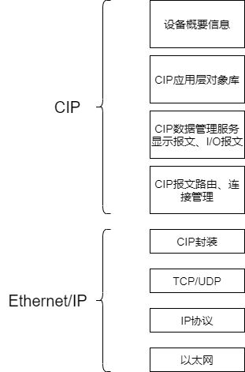

CIP 协议封装数据包的结构

- 命令：两字节整数，要求与通用工业协议规范中某条特定指令相关，在 CIP 协议中，即使设备不认识这个命令是什么也必须接收，而且异常处理时必须确保连接不中断，这种设计很好的保证了协议的稳定性，降低了中断连接的风险。CIP 协议本身有着实时性、确定性、可重复性、可靠性等特点。
- 长度：两字节整数，表示数据部分长度，不存在则为 0，比如说请求数据包就不存在数据部分
- 会话句柄：由目标设备生成，返回至会话发起方，作为一种凭证，证明你可以和我进行对话，这个凭证在接下来的对话里还会用到。
- 状态码：反应了接收方对设备发送的命令的执行能力，0 为成功执行，在请求数据包中永远为0，下面列出其他几种状态码。
    - 0×0001 无效或不支持的命令（这种命令异常处理时不中断运行）
    - 0×0002 接收方处理命令资源不足（这里我没找到相关资料描述，但根据 CIP 协议高稳定性原则推测应该会进行不中断运行等待资源足的时候进行执行）
    - 0×0003 数据格式不正确或数据不正确
    - 0×0065 接收到无效数据长度
- 最大延迟：由于工业以太网对实时性要求高，这里的内容是这个包经历的最大延迟。
- 发送方上下文：命令发送方会生成六个字节的值，接收方要原封不动的发回去，这个内容可以理解为回复的一种编号，发送方知道接收方收到了对应编号的报文，回复的是对相应报文的回复。
- 选项：始终为 0，不为 0 的话包会被抛弃。
- 命令相关数据：这就和我们接受和发送的命令和自身情况有关了。

Ethernet/IP 协议一般运行在 44818 端口上，还有 2222 端口来传送显式报文和隐式报文，可以通过这两个端口对相关设备进行扫描。

抓包分析过程见 [Wireshark笔记](../../../安全/工具/Wireshark.md#EthernetIP) 案例中 s7comm 部分

**相关文章**
- [工控安全EthernetIP协议分析](https://www.freebuf.com/articles/ics-articles/218674.html)

---

# Modbus

**简介**

早在 1971 年，Modicon 公司首次推出了 Modbus 协议，ModbusRTU 和 Modbus ASCII 诞生于此。后来施耐德电气收购了 Modicon 公司，并在 1997 年推出了 ModbusTCP 协议。ModbusRTU 和 ModbusASCII 主要用于串行通信领域，而 ModbusTCP 则常用于以太网通信。

Modbus 使用一种简单的 MasterandSlave 主从协议（客户机/服务器协议）进行通信。客户机作为主站，向服务器发送请求；服务器（从站）接到请求后，对请求进行分析并作出应答。其中使用的通信帧被称为应用数据单元（Application Data Unit，ADU），它包括通信地址段、功能代码段、数据段和校验段，如下图：

一般使用上，监控系统(HMI)都为 Master，PLC、电表、仪表等都为 Slave，HMI 系统一直 PollingSlave 的各种 relayandregister 最新数值，然后做显示及各种逻辑计算及控制调整等处理。

其中，功能代码段和数据段组合称为协议数据单元(Protocol Data Unit or Protocol Description Unit)，PDU）。功能代码段占用一个字节，取值范围为 1~255，其中 128~255 为保留值，用于异常消息应答报文。1~127 为功能代码编号，其中 65~72 和 100~110 为用户自定义编码，

**传输方式**

Modbus 协议是一种应用层报文传输协议，包括 ASCII、ＲTU、TCP 三种报文类型，协议本身并没有定义物理层，只是定义了控制器能够认识和使用的消息结构，而不管它们是经过何种网络进行通信的。

Modbus 协议使用串口传输时可以选择 ＲTU 或 ASCII 模式，并规定了消息、数据结构、命令和应答方式并需要对数据进行校验。ASCII 模式采用 LRC 校验，RTU 模式采用 16 位 CRC 校验。通过以太网传输时使用 TCP，这种模式不使用校验，因为 TCP 协议是一个面向连接的可靠协议。

**Modbus RTU 和 Modbus ASCII 区别**

Modbus 定义了与基础网络无关的数据单元（ADU），可以在以太网（TCP/IP）或串行链路上（RS232、RS485等）进行通信（以太网 ADU 和串行 ADU 略有不同）。在串行链路上，Modbus 协议有两种传输模式—— ASCII 模式和 RTU 模式。

Modbus 采用主从（Master-Salve）通信模式，仅有主设备（Master）能对传输进行初始化，从设备（Slave）根据主设备的请求进行应答。典型的主设备包括现场仪表和显示面板，典型的从设备为可编程逻辑控制器（PLC）。

在串行链路的主从通信中，Modbus 主设备可以连接一个或N（最大为247）个从设备，主从设备之间的通信包括单播模式和广播模式。

在广播模式中，Modbus 主设备可同时向多个从设备发送请求（设备地址0用于广播模式），从设备对广播请求不进行响应。

在单播模式中，主设备发送请求至某个特定的从设备（每个 Modbus 从设备具有唯一地址），请求的消息帧中会包含功能代码和数据，比如功能代码“01”用来读取离散量线圈的状态。从设备接到请求后，进行应答并把消息反馈主设备。

在主从设备的通信中，可以使用 ASCII 模式或者 RTU 模式。

在 ASCII 传输模式下，消息帧以英文冒号（“：”，ASCII3A Hex）开始，以回车和换号（CRLF，ASCII 0D and 0A Hex）符号结束，允许的传输的字符集为十六进制的 0~9 和 A~F；网络中的从设备监视传输通路上是否有英文冒号（“：”），如果有的话，就对消息帧进行解码，查看消息中的地址是否与自己的地址相同，如果相同的话，就接收其中的数据；如果不同的话，则不予理会。

在 ASCII 模式下，每个8位的字节被拆分成两个 ASCII 字符进行发送，比如十六进制数 0xAF ,会被分解成 ASCII 字符“A”和“F”进行发送，发送的字符量比 RTU 增加一倍。ASCII 模式的好处是允许两个字符之间间隔的时间长达 1s 而不引发通信故障，该模式采用纵向冗余校验(Longitudinal Redundancy Check ，LRC) 的方法来检验错误，

当控制器设为在 Modbus 网络上以 RTU 模式通信，消息中的每个 8Bit 字节都包含两个 4 Bit 的十六进制字符，这种模式没有开始和结束标记。其优点是: 在同样的波特率下，可比传送更多的数据。

在 RTU 模式下，每个字节可以传输两个十六进制字符，比如十六进制数 0xAF，直接以十六进制 0xAF（二进制：10101111）进行发送，因此它的发送密度比 ASCII 模式高一倍；RTU 模式采用循环冗余校验（CRC）.

**modbus TCP**

modbus TCP 和 modbus RTU 基本相同，但是也存在一些区别

1. 从机地址变得不再重要，多数情况下忽略。从某种意义上说从机地址被 IP 地址取代

2. CRC 校验变得不再重要，甚至可以忽略。由于 TCP 数据包中已经存在校验，为了不重复造轮子，modbus TCP 干脆取消了 CRC 校验。

TCP 模式是为了让 Modbus 数据顺利在以太网上传输产生的，使用 TCP502 端口。该协议物理层，数据链路层，网络层，传输层都是基于 TCP 协议，只在应用层，将 Modbus 协议修改后封装进去; 接收端将该 TCP 数据包拆封后，重新获得原始 Modbus 帧，然后按照 Modbus 协议规范进行解析，并将返回的数据包重新封装进 TCP 协议中，返回到发送端。与串行链路传输的数据格式不同，TCP 模式去除了附加地址和校验，增加了报文头.

**modbus tcp 和 TCP IP 的关系**

modbus TCP 可以理解为发生在 TCP 上的应用层协议，既然是 TCP 协议那么一个完整的 MODBUSTCP 报文必然包括 TCP 首部，IP 首部和 Ethernet 首部。

**安全问题**
- 缺乏认证：仅需要使用一个合法的 Modbus 地址和合法的功能码即可以建立一个 Modbus 会话
- 缺乏授权：没有基于角色的访问控制机制， 任意用户可以执行任意的功能。
- 缺乏加密：地址和命令明文传输， 可以很容易地捕获和解析

## 功能码

启动 Modbus 事务处理的客户机创建 Modbus 应用数据单元。功能码（PDU 中的）向服务器指示将执行哪种操作。

用一个字节编码 Modbus 数据单元的功能码域。有效范围是十制制 1-255（128-255 为异常响应保留）。当从客户机向服务器发送报文时，功能码域通过服务器执行哪种操作。

从客户机向服务器发送的报文数据域包括附加信息，服务器使用这个信息执行功能码定义的操作。这个域还包括离散项目和寄存器地址、处理项目的数量以及域中的实际数据字节数。

在某种请求中，数据域可以是不存在的，在此情况下服务器不需要任何附加信息。功能码仅说明操作。

**功能码的类型**

功能码主要分为有效功能码、异常功能码和错误功能码。

如果在一个正确接收 Modbus ADU 中，不出现与请求 Modbus 功能有关的差错，那么服务器至客户机的响应数据会包含请求中的正常功能码。如果出现与请求 Modbus 功能有关的差错，那么响应数据会包含一个异常码和错误码。

例如，客户机能够读一组离散量输出或输入的开/关状态，或者用户能够读/写一组寄存器数据内容。当服务器对客户机响应时，它使用功能码域来指示正常（无差错）响应或出现某种差错（称为异常响应）。对于一个正常响应来说，服务器仅对原始功能码响应，如下图：

对于异常响应，服务器返回一个与客户机等同的码，设置该原始功能码的最高有效位为逻辑1，并加该异常码后增加错误码，以通知客户机异常原因。

**有效功能码**

有效功能码有二十几种，但是一般使用上都以 1、2、3、4、5、6、15、16 等八种最为常用，以及另外特殊使用的 20、21 两种，此为 General Reference Register，绝大部份的 Modbus 设备并不会提供此 Register。于 PLC 上主要的控制数据有下列四种型式。

- DI：DigitalInput（数字输入，离散输入），一个地址一个数据位，用户只能读取它的状态，不能修改。以一个 bit 表示 On/Off，用来记录控制信号的状态输入，例如：开关，接触点，马达运转，超限 switch…等等。于 PLC 上被称为 Input relay、input coil 等。
- DO：DigitalOutput（数字输出，线圈输出），一个地址一个数据位，用户可以置位、复位，可以回读状态。以一个 bit 表示 On/Off，用来输出控制信号，以激活或停止马达，警铃，灯光…等等。于 PLC 上被称为 Output relay、Output coil等。
- AI：Analog Input（模拟输入，输入寄存器），一个地址16位数据，用户只能读，不能修改，，以 16 bits integer 表示一个数值，用来记录控制信号的数值输入，例如：温度、流量、料量、速度、转速、文件板开度、液位、重量…等等。于 PLC 上被称为 Input register。
- AO：AnalogOutput（模拟输出，保持寄存器），一个地址16位数据，用户可以写，也可以回读，以 16 bits integer 表示一个数值，用来输出控制信号的数值，例如：温度、流量、速度、转速、文件板开度、饲料量…等等设定值。于 PLC 上被称为 Output register、Holding register。

**相关文章**
- [工业控制系统安全之——Modbus学习笔记](https://www.freebuf.com/articles/ics-articles/148637.html)

---

# Profinet

**简介**

PROFINET 由 IP 国际组织推出，是新一代基于工业以太网技术自动化总线标准，PROFINET-DCP 是发现和基本配置协议，用于标识与查询有无指定 IP 地址节点，然后配置 IP 地址、默认网关、子网掩码。DCP 是标准的 PROFINET 功能，可以读写设备与网络地址相关参数。由于只能在一个局域网中使用，通过实时通道传输，使用 DCP 协议可以实现不需要额外组态工程操作就能替换设备。

**PROFINET-DCP set ip 流程**

1. 控制器在网内以设备名为参数广播 DCP_Identify.req 请求，确认设备是否存在,设备接收到请求，检查其中的设备名是否与设备自身名字匹配
2. 如果匹配则发送 DCP_Identify.rsp 响应控制器请求，否则不做处理
3. 控制器收到设备回复后，将设备 MAC 地址作为以太网报文的目标地址,控制器将IP地址、子网掩码与网关作为参数发送报文 DCP_Set.req 给设备
4. 设备设置 IP 地址等参数完毕后，发送 DCP_Set.rsp 给控制器

**相关文章**
- [一款针对Profinet协议漏洞渗透的工具](https://www.freebuf.com/sectool/203104.html)

---

# PROFIBUS

**简介**

一种用于工厂自动化车间级监控和现场设备层数据通信与控制的现场总线技术，可实现现场设备层到车间级监控的分散式数字控制和现场通信网络

---

# DNP3

**简介**

DNP(Distributed Network Protocol，分布式网络规约)是一种应用于自动化组件之间的通讯协议，常见于电力、水处理等行业。SCADA 可> 以使用 DNP 协议与主站、RTU、及 IED 进行通讯。

---

# ICCP

**简介**

电力控制中心通讯协议。

---

# OPC

**简介**

过程控制的 OLE （OLE for Process Control）。

OPC 包括一整套接口、属性和方法的标准集，用于过程控制和制造业自动化系统。

---

# Niagara Fox

**简介**

Fox 协议是 Tridium 公司开发的 Niagara 框架的一部分，广泛应用于楼宇自动化控制系统。

---

# BACnet

**简介**

楼宇自动控制网络数据通讯协议(BACnet)是针对采暖、通风、空调、制冷控制设备所设计，同时也为其他楼宇控制系统（例如照明、安保、消防等系统）的集成提供一个基本原则。

---

# GE-SRTP

**简介**

GE-SRTP 协议由美国通用电气公司开发，GE PLC 可以通过 GE-SRTP 进行数据通信和数据传输。

---

# HART-IP

**简介**

HART 协议是美国 Rosement 公司于1985年推出的一种用于现场智能仪表和控制室设备之间的通信协议。现已成为全球智能仪表的工业标准。

---

# PCWorx

**简介**

PCWorx 协议由菲尼克斯电气公司开发，目前广泛使用于工控系统。PCWORX3.11 是菲尼克斯电气公司的专用协议。

---

# MELSEC-Q

**简介**

MELSEC-Q 系列设备使用专用的网络协议进行通讯，该系列设备可以提供高速、大容量的数据处理和机器控制。

---

# OMRON FINS

**简介**

欧姆龙 PLC 使用网络协议 FINS 进行通信，可通过多种不同的物理网络，如以太网、控制器连接等。

---

# Crimson v3

**简介**

协议被 Crimson 桌面软件用于与 Red Lion G306 工控系统的 HMI 人机接口。

---

# Codesys

**简介**

CoDeSys 编程接口在全球范围内使用广泛，全球上百个设备制造商的自动化设备中都是用了该编程接口。

---

# ProConOS

**简介**

ProConOS 是德国科维公司(KW-Software GmbH)开发的用于 PLC 的实时操作系统，它是一个高性能的 PLC 运行时引擎，目前广泛使用于基于嵌入式和 PC 的工控系统。

---

# moxa-nport

**简介**

Moxa 串口服务器专为工业应用而设计。不通配置组合的串口服务器更能符合不同工业现场的需求。NPort 系列串口服务器让传统 RS-232/422/485 设备立即联网，提供基于 IP 的串口联网解决方案。