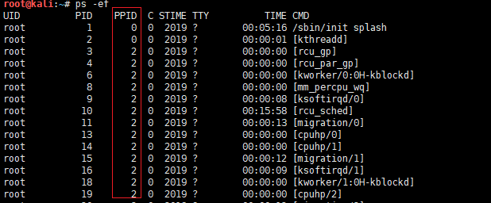

# 进程

---

# 基础

**PID**

每一个进程都有唯一的 ID（PID），是在进程表中识别进程的标识


**PPID**

这个进程的父进程



父进程跟子进程:
Linux 下，进程的创建，采用的是 Fork（派生）：用一个程序创建一个新进程的方法 。比如我创建一个进程 `ping`，必须通过另外的一个进程来派生，另外的进程就叫做父进程。比如


`ping` 在控制台下运行，是 bash 派生的

fork-exec：先用 fork 生成一个子进程,然后利用 exec 函数族用新进程映像取代调用进程映像。这时候 shell 将等待 fork-exec 子进程执行完毕，并重新显示 shell 提示信息。

**EUID（effective user id）**

uid 和 euid（effective user id）的区别：uid 就是你 login 的时候使用的 id，而 euid 则是你当前的有效 id。比如在 setuid 的程序里面去执行的时候会暂时性将 euid 变成文件所有者的 sid,但是 sid 没变

---

# 监视进程

```bash
ps -aux	    # 查看进程
ps aux | grep root	# 查看 root 运行的程序
ps -ef | grep root	# 查看 root 运行的程序

jobs	    # 显示 Linux 中的任务列表及任务状态
	jobs -l		    # 显示进程号

pidof program	    # 找出 program 程序的进程 PID
pidof -x script     # 找出 shell 脚本 script 的进程 PID

top					# 实时动态地查看系统的整体运行情况
free-h				# 显示当前系统未使用的和已使用的内存数目
vmstat 1			# 显示虚拟内存状态
ps					# 报告当前系统的进程状态
	ps -aux			# 显示现在所有用户所有程序
	# 由于ps命令能够支持的系统类型相当的多,所以选项多的离谱,这里略
pidstat -u -p ALL	# 查看所有进程的 CPU 使用情况

watch <Command>		# 以周期性的方式执行给定的指令,指令输出以全屏方式显示.
	-n : 指定指令执行的间隔时间(秒);
	-d : 高亮显示指令输出信息不同之处;
	-t : 不显示标题.
```

---

# 管理进程

**优先级**

内核程序利用优先级大小来判断何时及如何安排进程。每个进程都有两个优先级值：*静态值* 和 *动态值*。
- 我们通常讨论的优先级是指静态优先级，因为我们无法控制动态优先级。
- 优先级值的范围从-20到20（实际上为19）。大部分优先级的值为0
- 优先级值小的进程具有更高的优先级。即减少 niceness 值（优先级值）就意味着进程能获得更多的 CPU 时间。
- 子进程会继承父进程的优先级。

`nice` 更改优先级
```bash
nice -19 tar(19 是 niceness)
# 把这个 tar 命令执行后的优先级调到最低
```

`renice` 改变运行中进程的优先级
```bash
renice 19 50 (19 为 niceness,50 为 pid)
# 第二个参数是 niceness，第三个参数是 pid
```

**杀进程**

`kill` 用于杀死(结束)进程
```bash
kill -s STOP <PID>						    # 删除执行中的程序或工作
	kill -l								    # 显示信号
	kill -HUP <pid>						    # 更改配置而不需停止并重新启动服务
	kill -9 <PID> && kill -KILL <pid> 	    # 信号(SIGKILL)无条件终止进程
killall <PID>
```

---

# 进程状态

Linux中进程的七种状态
- R 运行状态（runing）: 并不意味着进程一定在运行中，也可以在运行队列里；
- S 睡眠状态（sleeping）: 进程在等待事件完成；（浅度睡眠，可以被唤醒）
- D 磁盘睡眠状态（Disk sleep）: 不可中断睡眠（深度睡眠，不可以被唤醒，通常在磁盘写入时发生）
- T 停止状态（stopped）: 可以通过发送 SIGSTOP 信号给进程来停止进程，可以发送 SIGCONT 信号让进程继续运行
- Z 僵尸状态（zombie）: 子进程退出，父进程还在运行，但是父进程没有读到子进程的退出状态，子进程进入僵尸状态；
- X 死亡状态（dead）: 该状态是返回状态，在任务列表中看不到；
- t 追踪停止状态（trancing stop）

**R (TASK_RUNNING)，可执行状态**

只有在该状态的进程才可能在 CPU 上运行。而同一时刻可能有多个进程处于可执行状态，这些进程的 task_struct 结构（进程控制块）被放入对应 CPU 的可执行队列中（一个进程最多只能出现在一个 CPU 的可执行队列中）。进程调度器的任务就是从各个 CPU 的可执行队列中分别选择一个进程在该 CPU 上运行。

很多操作系统教科书将正在 CPU 上执行的进程定义为 RUNNING 状态、而将可执行但是尚未被调度执行的进程定义为 READY 状态，这两种状态在 linux 下统一为 TASK_RUNNING 状态。

**S (TASK_INTERRUPTIBLE)，可中断的睡眠状态**

处于这个状态的进程因为等待某某事件的发生（比如等待 socket 连接、等待信号量），而被挂起。这些进程的 task_struct 结构被放入对应事件的等待队列中。当这些事件发生时（由外部中断触发、或由其他进程触发），对应的等待队列中的一个或多个进程将被唤醒。

通过 ps 命令我们会看到，一般情况下，进程列表中的绝大多数进程都处于 TASK_INTERRUPTIBLE 状态（除非机器的负载很高）。毕竟 CPU 就这么一两个，进程动辄几十上百个，如果不是绝大多数进程都在睡眠，CPU 又怎么响应得过来。

**D (TASK_UNINTERRUPTIBLE)，不可中断的睡眠状态**

与 TASK_INTERRUPTIBLE 状态类似，进程处于睡眠状态，但是此刻进程是不可中断的。不可中断，指的并不是 CPU 不响应外部硬件的中断，而是指进程不响应异步信号。

绝大多数情况下，进程处在睡眠状态时，总是应该能够响应异步信号的。否则你将惊奇的发现，kill -9 竟然杀不死一个正在睡眠的进程了！于是我们也很好理解，为什么 ps 命令看到的进程几乎不会出现 TASK_UNINTERRUPTIBLE 状态，而总是 TASK_INTERRUPTIBLE 状态。

而 TASK_UNINTERRUPTIBLE 状态存在的意义就在于，内核的某些处理流程是不能被打断的。如果响应异步信号，程序的执行流程中就会被插入一段用于处理异步信号的流程（这个插入的流程可能只存在于内核态，也可能延伸到用户态），于是原有的流程就被中断了。

在进程对某些硬件进行操作时（比如进程调用 read 系统调用对某个设备文件进行读操作，而 read 系统调用最终执行到对应设备驱动的代码，并与对应的物理设备进行交互），可能需要使用TASK_UNINTERRUPTIBLE状态对进程进行保护，以避免进程与设备交互的过程被打断，造成设备陷入不可控的状态。这种情况下的TASK_UNINTERRUPTIBLE状态总是非常短暂的，通过ps命令基本上不可能捕捉到。

**T (TASK_STOPPED or TASK_TRACED)，暂停状态或跟踪状态**

向进程发送一个 SIGSTOP 信号，它就会因响应该信号而进入 TASK_STOPPED 状态（除非该进程本身处于TASK_UNINTERRUPTIBLE 状态而不响应信号）。（SIGSTOP 与 SIGKILL 信号一样，是非常强制的。不允许用户进程通过signal系列的系统调用重新设置对应的信号处理函数。）

向进程发送一个 SIGCONT 信号，可以让其从 TASK_STOPPED 状态恢复到 TASK_RUNNING 状态。

当进程正在被跟踪时，它处于 TASK_TRACED 这个特殊的状态。“正在被跟踪”指的是进程暂停下来，等待跟踪它的进程对它进行操作。比如在 gdb 中对被跟踪的进程下一个断点，进程在断点处停下来的时候就处于 TASK_TRACED 状态。而在其他时候，被跟踪的进程还是处于前面提到的那些状态。

对于进程本身来说，TASK_STOPPED 和 TASK_TRACED 状态很类似，都是表示进程暂停下来。
而 TASK_TRACED 状态相当于在 TASK_STOPPED 之上多了一层保护，处于 TASK_TRACED 状态的进程不能响应 SIGCONT 信号而被唤醒。只能等到调试进程通过 ptrace 系统调用执行 PTRACE_CONT、PTRACE_DETACH 等操作（通过 ptrace 系统调用的参数指定操作），或调试进程退出，被调试的进程才能恢复 TASK_RUNNING 状态。

**Z (TASK_DEAD - EXIT_ZOMBIE)，退出状态，进程成为僵尸进程**

进程在退出的过程中，处于 TASK_DEAD 状态。

在这个退出过程中，进程占有的所有资源将被回收，除了 task_struct 结构（以及少数资源）以外。于是进程就只剩下 task_struct 这么个空壳，故称为僵尸。

之所以保留 task_struct，是因为 task_struct 里面保存了进程的退出码、以及一些统计信息。而其父进程很可能会关心这些信息。比如在 shell 中，$? 变量就保存了最后一个退出的前台进程的退出码，而这个退出码往往被作为 if 语句的判断条件。

当然，内核也可以将这些信息保存在别的地方，而将 task_struct 结构释放掉，以节省一些空间。但是使用 task_struct 结构更为方便，因为在内核中已经建立了从 pid 到 task_struct 查找关系，还有进程间的父子关系。释放掉 task_struct，则需要建立一些新的数据结构，以便让父进程找到它的子进程的退出信息。

父进程可以通过 wait 系列的系统调用（如 wait4、waitid）来等待某个或某些子进程的退出，并获取它的退出信息。然后 wait 系列的系统调用会顺便将子进程的尸体（task_struct）也释放掉。

子进程在退出的过程中，内核会给其父进程发送一个信号，通知父进程来“收尸”。这个信号默认是 SIGCHLD，但是在通过 clone 系统调用创建子进程时，可以设置这个信号。

**X (TASK_DEAD - EXIT_DEAD)，退出状态，进程即将被销毁。**

而进程在退出过程中也可能不会保留它的 task_struct。比如这个进程是多线程程序中被 detach 过的进程。或者父进程通过设置 SIGCHLD 信号的 handler 为 SIG_IGN，显式的忽略了 SIGCHLD 信号。（这是 posix 的规定，尽管子进程的退出信号可以被设置为 SIGCHLD 以外的其他信号。）

此时，进程将被置于 EXIT_DEAD 退出状态，这意味着接下来的代码立即就会将该进程彻底释放。所以 EXIT_DEAD 状态是非常短暂的，几乎不可能通过 ps 命令捕捉到。

**进程的初始状态**

进程是通过 fork 系列的系统调用（fork、clone、vfork）来创建的，内核（或内核模块）也可以通过 kernel_thread 函数创建内核进程。这些创建子进程的函数本质上都完成了相同的功能——将调用进程复制一份，得到子进程。（可以通过选项参数来决定各种资源是共享、还是私有。）

那么既然调用进程处于 TASK_RUNNING 状态（否则，它若不是正在运行，又怎么进行调用？），则子进程默认也处于 TASK_RUNNING 状态。

另外，在系统调用调用 clone 和内核函数 kernel_thread 也接受 CLONE_STOPPED 选项，从而将子进程的初始状态置为 TASK_STOPPED。

**进程状态变迁**

进程自创建以后，状态可能发生一系列的变化，直到进程退出。而尽管进程状态有好几种，但是进程状态的变迁却只有两个方向——从 TASK_RUNNING 状态变为非 TASK_RUNNING 状态、或者从非 TASK_RUNNING 状态变为 TASK_RUNNING 状态。

也就是说，如果给一个 TASK_INTERRUPTIBLE 状态的进程发送 SIGKILL 信号，这个进程将先被唤醒（进入 TASK_RUNNING 状态），然后再响应 SIGKILL 信号而退出（变为 TASK_DEAD 状态）。并不会从 TASK_INTERRUPTIBLE 状态直接退出。

进程从非 TASK_RUNNING 状态变为 TASK_RUNNING 状态，是由别的进程（也可能是中断处理程序）执行唤醒操作来实现的。执行唤醒的进程设置被唤醒进程的状态为 TASK_RUNNING，然后将其 task_struct 结构加入到某个 CPU 的可执行队列中。于是被唤醒的进程将有机会被调度执行。

而进程从 TASK_RUNNING 状态变为非 TASK_RUNNING 状态，则有两种途径：
1. 响应信号而进入 TASK_STOPED 状态、或 TASK_DEAD 状态；
2. 执行系统调用主动进入 TASK_INTERRUPTIBLE 状态（如 nanosleep 系统调用）、或 TASK_DEAD 状态（如 exit 系统调用）；或由于执行系统调用需要的资源得不到满足，而进入 TASK_INTERRUPTIBLE 状态或 TASK_UNINTERRUPTIBLE 状态（如 select 系统调用）。

显然，这两种情况都只能发生在进程正在 CPU 上执行的情况下。

---

**Reference**
- [Linux操作系统中进程的七种状态](https://blog.csdn.net/weixin_39294633/article/details/80231033)
- [Linux进程状态解析 之 R、S、D、T、Z、X (主要有三个状态)](https://blog.csdn.net/sdkdlwk/article/details/65938204)
