# 认证

---

# 本地认证

在 Windows 系统中本机用户的密码 Hash 是放在本地的 `SAM` 文件里面，域内用户的密码 Hash 是存在域控的 `NTDS.DIT` 文件里面。

sam 的简称是Security Account Manager，安全账户管理器。

Windows XP、Windows Vista、Windows 7、Win 8.1 Win 10 的用户密码以 hash 形式存储在 `%SystemRoot%\system32\config\sam` 数据库文件中。被保存的 hash 分为 `LM Hash` 和 `NTLM hash`；微软在 Windows NT 4.0 中引入 SYSKEY 对 `SAM` 文件加密。

所谓哈希（hash），就是使用一种加密函数进行计算后的结果。这个加密函数对一个任意长度的字符串数据进行一次数学加密函数运算，然后返回一个固定长度的字符串。现在已经有了更新的 NTLMv2 以及 Kerberos 验证体系。Windows 加密过的密码口令，我们称之为 hash，Windows 的系统密码 hash 默认情况下一般由两部分组成：第一部分是 LM-hash，第二部分是 NTLM-hash。

登录系统的时候,系统会自动地读取 `SAM` 文件中的密码与键入的密码进行比对，如果相同，则认证成功。

操作系统启动之后，`SAM` 文件将同时被锁定。这意味着操作系统运行之时，用户无法打开或复制 `SAM` 文件。除了锁定，整个 `SAM` 文件还经过加密，且不可见。

**LM Hash**

LAN Manager（LM）哈希是 Windows 系统所用的第一种密码哈希算法，是一种较古老的 Hash，在 LAN Manager 协议中使用，非常容易通过暴力破解获取明文凭据。它只有唯一一个版本且一直用到了 NT LAN Manager（NTLM）哈希的出现，在 Windows Vista/Windows 7/Windows Server 2008 以及后面的系统中，LM 哈希算法是默认关闭的，LM 算法是在 DES 基础上实现的，不区分字母大小写。
- 生成原理
    1. 用户的密码转换为大写，密码转换为16进制字符串，不足14字节将会用0来再后面补全。
    2. 密码的16进制字符串被分成两个 7byte 部分。每部分转换成比特流，并且长度位 56bit，长度不足用0在左边补齐长度
    3. 再分 7bit 为一组,每组末尾加 0，再组成一组
    4. 上步骤得到的二组，分别作为 key 为 `KGS!@#$%` 进行 DES 加密。
    4. 将加密后的两组拼接在一起，得到最终 LM HASH 值。

**NTLM Hash**

NT LAN Manager（NTLM）哈希是 Windows 系统认可的另一种算法，用于替代古老的 LM-Hash，一般指 Windows 系统下 Security Account Manager（SAM）中保存的用户密码 hash，在 Windows Vista/Windows 7/Windows Server 2008 以及后面的系统中，NTLM 哈希算法是默认启用的。

当用户登录时，将用户输入的明文密码加密成 `NTLM Hash`，与 `SAM` 数据库文件中的 `NTLM Hash` 进行比较。

在渗透测试中，通常可从 Windows 系统中的 `SAM` 文件和域控的 `NTDS.dit` 文件中获得所有用户的 hash，通过 Mimikatz 读取 `lsass.exe` 进程能获得已登录用户的 `NTLM hash`。

- 生成原理
    1. 先将用户密码转换为十六进制格式。
    2. 将十六进制格式的密码进行 Unicode 编码。
    3. 使用 MD4 摘要算法对 Unicode 编码数据进行 Hash 计算

- 快速生成
    ```bash
    python2 -c 'import hashlib,binascii; print binascii.hexlify(hashlib.new("md4", "P@ssw0rd".encode("utf-16le")).digest())'
    ```

**本地认证流程**

```bash
winlogon.exe -> 接收用户输入 -> lsass.exe -> 认证
```

1. 当刚开机、注销等操作后，winlogon.exe 进程会显示一个登录界面要求输入用户名和密码。
2. 输入用户名和密码后，会被 winlogon.exe 获取，然后将其发送给 lsass.exe 进程。
3. lsass.exe 将明文密码计算得到 NT Hash（不考虑LM）。
4. 之后会将用户名和计算得到的 NT Hash 拿到 SAM 数据库去查找比对。


- Windows Logon Process(即 winlogon.exe)，是Windows NT 用户登陆程序，用于管理用户登录和退出。
- LSASS 用于微软 Windows 系统的安全机制。用于本地安全和登陆策略。

---

# 网络认证

在内网渗透中，经常遇到工作组环境，而工作组环境是一个逻辑上的网络环境(工作区)，隶属于工作组的机器之间无法互相建立一个完美的信任机制，只能点对点，是比较落后的认证方式，没有信托机构。

假设 A 主机与 B 主机属于同一个工作组环境，A 想访问 B 主机上的资料，需要将一个存在于 B 主机上的账户凭证发送至 B 主机，经过认证才能够访问 B 主机上的资源。

这是我们接触比较多的 SMB 共享文件的案例，SMB 的默认端口是 445。

早期 SMB 协议在网络上传输明文口令。后来出现 LAN Manager Challenge/Response 验证机制，简称 LM，它很容易被破解，就又有了 NTLM 以及 Kerberos。

**Net-NTLM hash**

NTLM 是一种网络认证协议,以 NTLM Hash 作为凭证进行认证。NTLM Hash 长度为32位，由数字和字母组成,采用挑战/响应（Challenge/Response）的消息交换模式，流程如下：

1. 客户端向服务器发送一个请求，请求中包含明文的登录用户名。服务器会提前存储登录用户名和对应的密码 hash
2. 服务器接收到请求后，生成一个16位的随机数(这个随机数被称为 Challenge),明文发送回客户端。使用存储登录用户密码 hash 加密 Challenge，获得 Challenge1
3. 客户端接收到 Challenge 后，使用登录用户的密码 hash 对 Challenge 加密，获得 Challenge2(这个结果被称 response)，将 response 发送给服务器
4. 服务器接收客户端加密后的 response，比较 Challenge1 和 response，如果相同，验证成功


在以上流程中，登录用户的密码 hash 即 NTLM hash，response 中包含 Net-NTLM hash

在 NTLM 认证中，NTLM 响应分为 NTLM v1，NTLMv2，NTLM session v2 三种协议，不同协议使用不同格式的 Challenge 和加密算法

所以也就存在不同协议的 Net-NTLM hash，即 Net-NTLM v1 hash，Net-NTLM v2 hash

**NTLMv2 协议**

NTLMv1 和 NTLMv2 的加密因素都是 NTLM Hash，而最显著的区别就是 Challenge 和加密算法不同：
- Challage： NTLMv1 的 Challenge 有8位，NTLMv2 的 Challenge 为16位。
- Net-NTLM Hash：NTLMv1 的主要加密算法是 DES，NTLMv2 的主要加密算法是 HMAC-MD5。

## PTH

详细内容见 [Windows渗透](../../../安全/笔记/RedTeam/Windows渗透.md#PTHPTKPTT) PTH 部分

---

# 域认证

> 域认证部分内容来自 https://b404.xyz/2019/07/23/Study-Windows-Authentication/

## AD

Active Directory，活动目录简称 AD，是一个基于 DNS 并以树状的数据结构来组成网络服务存储了有关网络对象的信息，并以此作为基础对目录信息进行合乎逻辑的分层组织，让管理员和用户能够轻松地查找和使用这些信息。常网域都只有一个，在中型或大型的网络中，网域可能会有很多个，或是和其他公司或组织的 AD 相互链接。

网络对象分为用户、用户组、计算机、域、组织单元以及安全策略。

**活动目录（AD）功能**

- 服务器及客户端计算机管理 : 管理服务器及客户端计算机账户， 所有服务器及客户端计算机加入域管理并实施组策略。
- 用户服务 : 管理用户域账户、用户信息、企业通讯录(与电子邮 件系统集成)、用户组管理、用户身份认证、用户授权管理等， 按省实施组管理策略。
- 资源管理 : 管理打印机、文件共享服务等网络资源。
- 桌面配置 : 系统管理员可以集中的配置各种桌面配置策略，如: 用户使用域中资源权限限制、界面功能的限制、应用程序执行特 征限制、网络连接限制、安全配置限制等。
- 应用系统支撑 : 支持财务、人事、电子邮件、企业信息门户、办 公自动化、补丁管理、防病毒系统等各种应用系统。

**存储方式**

- ntds.dit

    ntds.dit 是 AD 中的数据库文件，它被保存在域控制器 `C:\Windows\NTDS\NTDS.dit` 位置。活动目录的数据库文件（ntds.dit）包含有关活动目录域中所有对象的所有信息，其中包含所有域用户和计算机帐户的密码哈希值。该文件在所有域控制器之间自动同步，它只能被域管理员访问和修改。

- LDAP

    ldap 是基于 tcp/ip 的轻量级目录访问协议，这种数据库文件后缀都为 `.ldif`,并使用特殊的节点查询语句来获取相应数据。和常规关系型数据库不同的是,ldap 并非按照常规的库、表、字段方式来存储数据，而是按照一种特殊的倒树状结构层级来组织管理数据,此处的树指的就是目录信息树,即 DIT。(目录信息树相当于专门用来进行读操作的数据库。)

    在目录信息树里创建一个条目（entry）时，条目的信息存储在属性（attribute）里，属性又被组合成对象类（objectClass），对象类进一步组成了架构（schema）

    在DIT内部则由N个条目entry所组成,就相当于常规数据库表中每条具体的记录，而条目的内容则是由具有唯一标识名 DN 的属性[Attribute]及属性对应的值[value]所组成的一个集合。

    条目为 ldap 中最基础的操作单位,通常对ldap的增、删、改、查都是以条目为基本单元进行的。

    本地打开 LDAP 编辑器。运行->打开 `adsiedit.msc`（只有域控居于整个域内的配置信息）

## Kerberos

Kerberos 是一种计算机网络授权协议，用来在非安全网络中，对个人通信以安全的手段进行身份认证。软件设计上采用客户端/服务器结构，并且能够进行相互认证，即客户端和服务器端均可对对方进行身份认证。可以用于防止窃听、防止重放攻击、保护数据完整性等场合，是一种应用对称密钥体制进行密钥管理的系统。支持 SSO。Kerberos 的扩展产品也使用公开密钥加密方法进行认证。

当有N个人使用该系统时，为确保在任意两个人之间进行秘密对话，系统至少保存有它与每个人的共享密钥，所需的最少会话密钥数为N个。

Kerberos 协议基于对称密码学，并需要一个值得信赖的第三方。Kerberos 协议的扩展可以为认证的某些阶段提供公钥密码学支持。

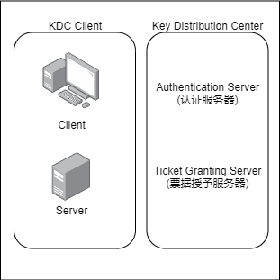

**Kerberos 认证所参与的角色**
- 访问服务的 Client
- 提供服务的 Server
- KDC(Key Distribution Center,密钥分发中心) = DC(Domain Controller)

其中 KDC 服务默认安装在一个域的域控中，而 Client 和 Server 为域内的用户或者是服务，如 HTTP 服务、SQL 服务。在 Kerberos 中 Client 是否有权限访问 Server 端的服务由 KDC 发放的票据来决定

**认证过程**


当 Client 想要访问 Server 上的某个服务时，需要先向 AS 证明自己的身份，然后通过 AS 发放的 TGT 向 Server 发起认证请求，这个过程分为三块：

- The Authentication Service Exchange： Client 与 AS 的交互
    - AS_REQ
    - AS_REP
- The Ticket-Granting Service (TGS) Exchange： Client 与 TGS 的交互
    - TGS_REQ
    - TGS_REP
- The Client/Server Authentication Exchange： Client 与 Server 的交互
    - AP_REQ
    - AP_REP
- 每次交互 Client 可以收到两条消息，一条是可以解密的，一条是无法解密的
- Client 期望访问的服务或者主机从不直接与 KDC 通信
- KDC 存储了其数据库下所有主机和服务的密钥
- 密钥由密码加上一组随机数的哈希值，哈希算法由 Kerberos 的具体实现选择。对于服务和主机而言，其本身是没有密码的。一个密码实际上是由管理员的初始启动时产生和存储于服务和主机中的
- 所有密钥存储于 KDC 数据库
- KDC 本身由主密钥加密
- 已经存在 Kerberos 的配置和实现采用公钥加密

认证中涉及到的部分词汇：
- AD（Account Database）：存储所有 Client 白名单，只有存在于白名单的 Client 才能申请到 AS 给的 TGT。
- Authentication Server： 为 Client 生成 TGT 的服务。 AS 的作用是验证 Client 端的身份，验证通过就会给一个TGT（Ticket Granting Ticket）票据给 Client。
- Ticket Granting Server： 为 client 生成某个服务的 ticket。 TGS 的作用是通过 AS 发送给 Client 的票据（TGT）换取访问 Server 端的 ST 票据。ST（Service Ticket）也有资料称为 TGS Ticket，为了和 TGS 区分，此处使用 ST
- Session Key：会话密钥，只有 Client 和 TGS 知道
- 票据（Ticket）：是网络对象互相访问的凭证。
- TGT（Ticket Granting Ticket）：入场券，通过入场券能够获得票据，是一种临时凭证的存在。

整体过程如图

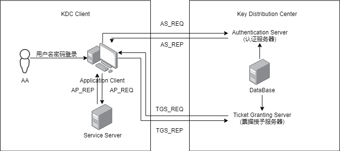

- **用户登录**

    用户登录阶段，通常由用户(AA)输入[用户名][密码]信息，在客户端侧，用户输入的密码信息被一个单向 Hash 函数生成 Client 密钥，即 AA 的 NTLM Hash：

    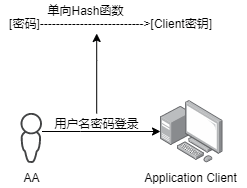

- **请求身份认证**

    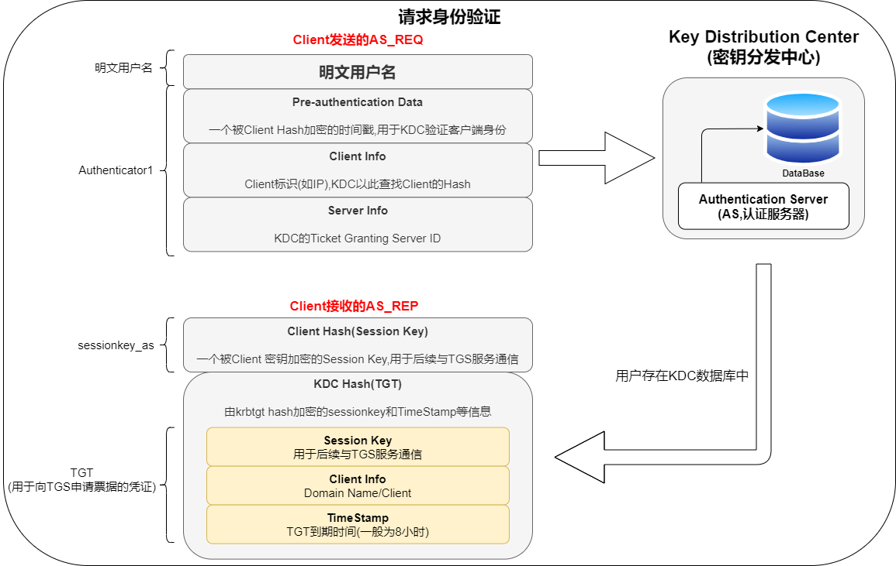

    - **客户端向 AS 发送请求认证**

        KRB-AS-REQ：Client 发送明文 `用户名 AA` 和 `Authenticator1` 信息到 KDC （Key Distribution Center）。Authenticator1 的内容为使用 Client 密码哈希加密的时间戳、Client ID、网络类型、加密类型等：

    - **AS 确认客户端登陆者身份**

        KRB-AS-REP：AS 收到用户认证请求后，AS 根据请求中的 `用户名 AA` 信息，从数据库中查找用户名是否存在。如果 `用户名 AA` 存在，则从 KDC 中可以获取 `用户 AA` 的密码，使用单向函数为该密码生成一个 `Client 密钥`（即NTLM Hash）。

        AS 生成随机字符串 `Client/TGS Session Key`，使用 `Client 密钥`(用户 AA 的密码 NTLM Hash )对 `Client/TGS Session Key` 加密得到 `sessionkey_as`；

        再使用 TGS 密钥(krbtgt 用户的 NTLM Hash)对 `Client/TGS Session Key` 、 `Client Info` 和 `Timestamp` 加密,得到 `TGT`（TGT票据）。

        将 `sessionkey_as` 和 `TGT` 一起返回给 Client。

        Client 收到 AS 的响应消息后，利用自身的 `Client 密钥`（AA 的 NTLM Hash）对 `sessionkey_as` 解密，这样就获取到 `Client/TGS Session Key`。

        > AS 的响应消息中有一条是属于 Client 的，有一条是 TGS 的。

- **请求授权访问服务**

    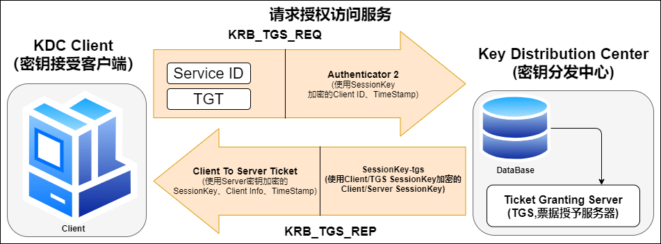

    - **客户端向 TGS 发送请求服务授权请求**

        KRB-TGS-REQ：Client 收到 `sessionkey_as` 和 `TGT` 后，使用 `Client 密钥`（AA 的 NTLM Hash）对 `sessionkey_as` 解密就能得到 `Client/TGS Session Key`，然后使用 `Client/TGS Session Key` 对 Client Info 和 timestamp 加密得到 `Authenticator2`。

        将 `Authenticator2`、`TGT`、`Service ID`（要请求的服务 ID）发送给 KDC 中的 TGS。

        > 由于 TGT 是使用 `TGS 密钥`(krbtgt 的 NTLM Hash)加密的，Client 无法对 TGT 解密。

    - **TGS 为 Client 响应服务授权票据**

        TGS-REP：TGS 收到请求后，检查 KDC 数据库中是否存在所请求的服务(`Service ID`)。如果存在，TGS 使用 `TGS 密钥`(krbtgt 的 NTLM Hash)解密 TGT，得到 `Client/TGS Session Key`、timestamp、Client info；同时使用从 TGT 中解密得到的 `Client/TGS Session Key` 去解密 `Authenticator2`，得到 Client info 和 timestamp。 比对 `Authenticator2` 和 `TGT` 的解密内容以验证通过。

        - TGS 比对 `Authenticator2` 包含的 `Client ID` 和 `TGT` 中的 `Client ID`
        - 比较时间戳（误差范围在2分钟）
        - 通过生命周期字段检查 TGT 是否过期
        - 检查 `Authenticator2` 已经不再 TGS 的缓存中
        - 若原始请求中的网络地址不为 NULL，比较 TGT 中的 IP 和请求的 IP

        验证成功后，随机生成 Client 所请求服务的会话密钥 `Client/Server Session Key`；

        使用 Server 密钥（即服务器计算机的NTLM Hash）对 `Client/Server Session Key`、`Client Info`（包含 Client ID）、`TimeStamp` 加密得到 `Client-To-Server Ticket`（也称为 ST 票据）；

        使用 `Client/TGS Session Key` 对 `Client/Server Session Key` 加密得到 `sessionkey_tgs`

        最终将 `Client-To-Server Ticket`、`sessionkey_tgs` 返回给 Client。

- **请求服务**

    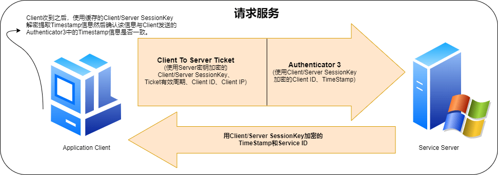

    - **Client 向SS(Service Server)发送服务请求**

        AP-REQ：Client 收到 `Client-To-Server Ticket`、`sessionkey_tgs` 之后，使用 `Client/TGS Session Key` 对 `sessionkey_tgs` 解密得到 `Client/Server Session Key`,然后使用 `Client/Server Session Key` 对 Client Info 和 timestamp 加密得到 `Authenticator3`

        将 `Authenticator3` 和 `Client-To-Server Ticket` 发送给所请求服务的服务器(`Service Server`)。

    - **Service Server响应Client**

        AP-REP：Service Server 收到客户端的服务访问请求之后，利用 Server 密钥(Server 的 ntlm Hash)对 `Client-To-Server Ticket` 解密，提取出 `Client/Server SessionKey`、Client ID 等信息。

        Service Server 使用 `Client/Server SessionKey` 对 `Authenticator3` 解密得到 Client ID 和 TimeStamp。

        类似于 TGS，Service Server 也要做如下校验：
        - Client ID;
        - 时间戳；
        - ticket 是否过期；
        - 避免重放攻击，查看 Service Server 的 cache 是否包含 authenticator3；
        - 网络地址比较

        Service Server 发送最后的验证消息——用 `Client/Server SessionKey` 加密的 Timestamp 和 `Service ID` 数据包给 Client。

        Client 收到之后，使用缓存的 `Client/Server SessionKey` 解密提取 Timestamp 信息，然后确认该信息与 Client 发送的 Authenticator3 中的 Timestamp 信息是否一致。验证通过后，在定义的通讯周期内，Client 可以使用票据请求 Service。

        由此完成了 Client 和 Service Server 的双向认证。

        - Kerberos 协议设计的思路就是用来在不受信的环境下进行认证的协议。
        - krbtgt 账号的 NTLM Hash 理论上只存在于 KDC 中。这意味着 TGT 只能由 KDC 来解密。如果 krbtgt 账号的 NTLM Hash 泄露了，那么 TGT 就能被解密甚至伪造。伪造的 TGT 叫做黄金票据。
        - Ticket 是由服务器计算机本身的 NTLM Hash 加密的，Client 不能解密。如果该 Hash 泄露，那么就可以解密甚至伪造 Ticket。伪造的 Ticket 叫做白银票据。
        - 在上述的流程中，涉及到时间戳 timestamp，由于它的存在，才使得被第三方获取了加密信息 Authenticator1 、Authenticator2、TGT 不会在短时间内被暴力破解。timestamp 一般时间为8小时。
        - Kerberos 协议和 NTLM 协议都会使用 NTLM Hash 对生成的任意随机数加密，然后比对结果。 Kerberos 的主要区别在于添加了第三方——-KDC 参与到认证过程中。
        - Client info 中包含网络地址、Client ID 等信息

## PAC

上述为 RFC 规定的 Kerberos 认证授权流程(其中 NTLM Hash 是针对 Windows 举例的)，而微软所实现的 Kerberos 工作流程与之则有所不同，其区别的关键就在于，KDC 所返回的 `KRB_AS_REP` 中将包含一组 PAC 的信息。

PAC 的全称是 Privilege Attribute Certificate(特权属性证书)。其中所包含的是各种授权信息，例如用户所属的用户组、用户所具有的权限等。（User SID 和 Groups SID）

为了防止被伪造和串改，在 PAC 中包含有两个数字签名 `PAC_SERVER_CHECKSUM` 和 `PAC_PRIVSVR_CHECKSUM` ，这两个数字签名分别由 Server 端密码 HASH 和 KDC 的密码 HASH 加密。

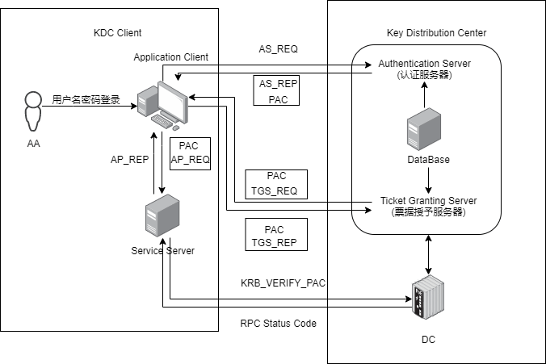

正如上文所述，当用户与 KDC 之间完成了认证过程之后， 用户需要访问服务器所提供的某项服务时， 服务器为了判断用户是否具有合法的权限必须通过将用户的用户名传递给 KDC， KDC 通过得到的用户名查询用户的用户组信息，用户权限等，进而返回给服务器，服务器再将此信息与用户所索取的资源的 ACL 进行比较， 最后决定是否给用户提供相应的服务。

在 Windows 的 Kerberos 实现中， 默认情况下，`KRB_AS_REP` 信息中将包含一组 PAC 信息，也就是说，用户所得到的 TGT（TicketGranting Ticket）会包含用户的授权信息。用户再用包含有授权信息的 TGT 去申请相应的 Service Ticket，KDC 在收到这个 `KBR_AP_REQ` 请求的时候， 将 TGT 里的 PAC 信息解析出来， 加入到 Service Ticket 里返回。接下来， 当用户向服务器程序提交 `KRB_AP_REQ` 消息时， 服务器程序则将其中所包含的 PAC 信息传送给操作系统得到一个访问令牌， 并且同时将这个 PAC 的数字签名以 `KRB_VERIFY_PAC` 的消息传输给 KDC， KDC 再将验证这个 PAC 的数字签名的结果以 RPC 返回码的形式告诉服务器， 服务器就可以根据这个结果判断 PAC 数据的真实性和完整性，并做出最后对 `KRB_AP_REQ` 的判断。

- 优点：
    - 以后对资源的访问中，服务端再接收到客户的请求的时候不再需要借助 KDC 的帮助提供完整的授权信息来完成对用户权限的判断， 而只需要根据请求中所包含的 PAC 信息直接与本地资源的 ACL 相比较做出裁决。
    - 解决 PAC 欺骗，防止攻击者利用篡改的 PAC 信息实现未授权访问
- 缺点：
    - PAC 在用户的认证阶段引入会导致认证耗时过长。（Windows Kerberos 客户端会通过 RPC 调用 KDC 上的函数来验证 PAC 信息，这时候用户会观察到在服务器端与 KDC 之间的 RPC 包流量的增加。）
    - 由于 PAC 是微软特有的一个特性，所以启用了 PAC 的域中将不支持装有其他操作系统的服务器，制约了域配置的灵活性

---

## SPN

服务主体名称（SPN：Service Principal Names）是服务实例（可以理解为一个服务，比如HTTP、MSSQL）的唯一标识符（即服务器上所运行服务的唯一标识）。Kerberos使用SPN将服务实例与服务登录帐户相关联。如果在整个域 或 域林中的计算机上安装多个服务实例，则每个实例都必须具有自己的SPN。如果客户端使用多个名称进行身份验证，则给定的服务实例具有多个SPN。SPN始终包含运行服务实例的主机名称，因此服务实例可以为其主机的每个名称或别名注册SPN。

> 使用 Kerberos 的域认证认证服务，需要正确配置 SPN

SPN 在其注册的域林中必须是唯一的，若不唯一，则身份验证就会失败。

SPN 的格式：
```
<service type>/<host>:<port>/<DistinguishedName>

// <service type>：服务类型，如LDAP、TERMSRV、SMTP、MSSQL、HTTP
// <host>：服务所在主机名称，可以是FQDN(如data.test.lab、server.test.lab)和NetBIOS名(如data、server)

// <port>：服务端口，若服务运行在默认端口上，则端口号可以省略
// <Distinguished Name>：专有名称
```

通用服务类型 ,可参考 https://adsecurity.org/?page_id=183

### SPN扫描

详细内容见 [后渗透](../../../安全/笔记/RedTeam/后渗透.md#SPN扫描) SPN扫描部分

### Kerberoast

详细内容见 [Windows渗透](../../../安全/笔记/RedTeam/Windows渗透.md#kerberoast) Kerberoast 部分

### Kerberoasting

详细内容见 [Windows渗透](../../../安全/笔记/RedTeam/Windows渗透.md#kerberoasting) Kerberoasting 部分

## PTT

详细内容见 [Windows渗透](../../../安全/笔记/RedTeam/Windows渗透.md#pthptkptt) PTT 部分

## 委派

委派(Delegation)：是一种让用户可以委托服务器代表自己与其他服务进行验证的功能，它允许服务账户在活动目录中模拟其他域用户身份，主要用于当服务需要以某个用户的身份来请求访问其他服务资源的场景。比如，在域内，用户 Jack 经过 Kerberos 身份验证访问服务 Web（服务 web 处于域），Web 服务再以 Jack 的身份去请求域中的服务 MSSQL，若 Jack 有权限访问就能访问成功，这种过程就是委派的一个过程。

域委派的4种主要方式：
- 无约束委派
    - 表示您授予该帐户权限以委派任何服务，前提是满足启动委派所需的所有其他步骤。
    - 从 IT 安全角度来看，此选项最容易配置但安全性最低。
- 约束委派 - 仅限 Kerberos
    - 更安全，它将委派任务限制到指定列表，不像无约束委派允许委派给任何服务。
    - 与无约束委派相比，需要额外配置。
    - 必须确保在帐户上设置 SPN 并添加允许帐户委派的服务。
- 协议转换
- 基于资源的约束委派

用户在 Kerberos 认证中访问服务 A 和服务 B 的过程图：

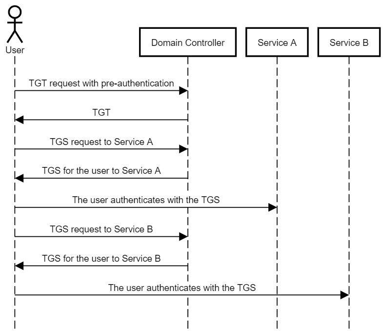

后改进了这种同一用户访问多服务的过程，实现了 A 服务模拟用户访问 B 服务的过程。

在用户发送一个 ST(图中为 TGS)访问服务时，连同其TGT一起发送，服务 A 使用用户的 TGT 向服务B进行 ST(图中为 TGS)，进而简化了用户请求服务 B 资源时验证访问的认证过程。这种就是无约束委派（TrustedForDelegation）的过程：

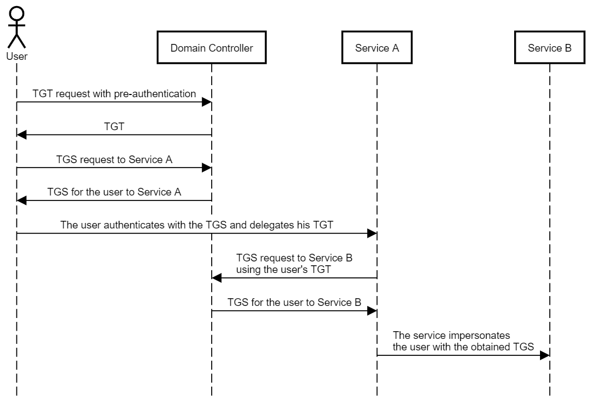

无约束委派过程中，如果攻击者截获了 Service A 验证的 ST 和 TGT，就可以用它们访问服务 B，进而模拟管理员访问任意服务，漫游内网。

**约束委派 S4U2Proxy**

为了解决无约束委派的隐患，微软发布了约束委派（S4U2Proxy）。

若服务 A 允许委派给服务B，则 A 能使用 S4U2Proxy 协议将用户发送的 TS(图中的 TGS，TGS 必须是可转发的) 再转发给域控制器认证，为用户请求访问服务 B 的 TS(图中的 TGS)。接着，服务 A 就能使用新获得的 TS(图中的 TGS）模拟用户访问服务 B:

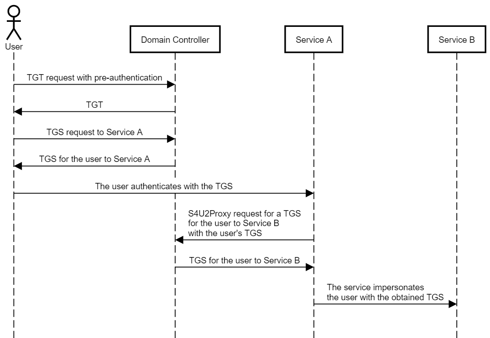

上图中用户是通过 Kerberos 协议与服务 A 进行认证的，而当用户以其他方式(如 NTLM 认证，基于表单的认证等方式)与 Web 服务器进行认证后，用户是无法向 Web 服务器提供请求该服务的 TS(图中的 TGS)，因而服务器 A 也无法进一步使用 S4U2Proxy 协议请求访问服务 B。S4U2Self 协议便是解决该问题的方案，被设置为 `TrustedToAuthForDelegation` 的服务能够调用 S4U2Self 向认证服务器为任意用户请求访问自身的可转发的服务票据，此后，便可通过 S4U2Proxy 使用这张 TGS 向域控制器请求访问 B 的票据。这就是协议转换委派(S4U2Self/TrustedToAuthForDelegation)：

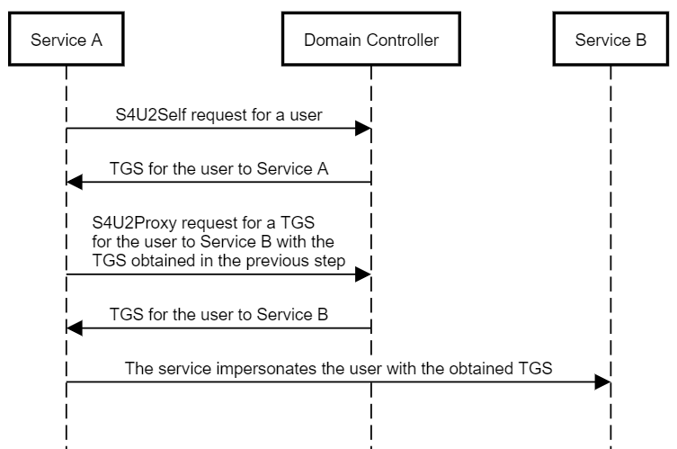

**基于资源的约束委派**

传统的约束委派中仍然存在一些缺点，如无法进行跨域委派。微软在 Windows Server 2012 中引入了基于资源的约束委派，相对于传统的约束委派，主要有三处改进:
- 委派的权限授予给了拥有资源的后端(B)而不再是前端(A)
- 不再需要域管理员权限设置委派，只需拥有在计算机对象上编辑 `msDS-AllowedToActOnBehalfOfOtherIdentity` 属性的权限
- 委派功能现在可以跨域和林

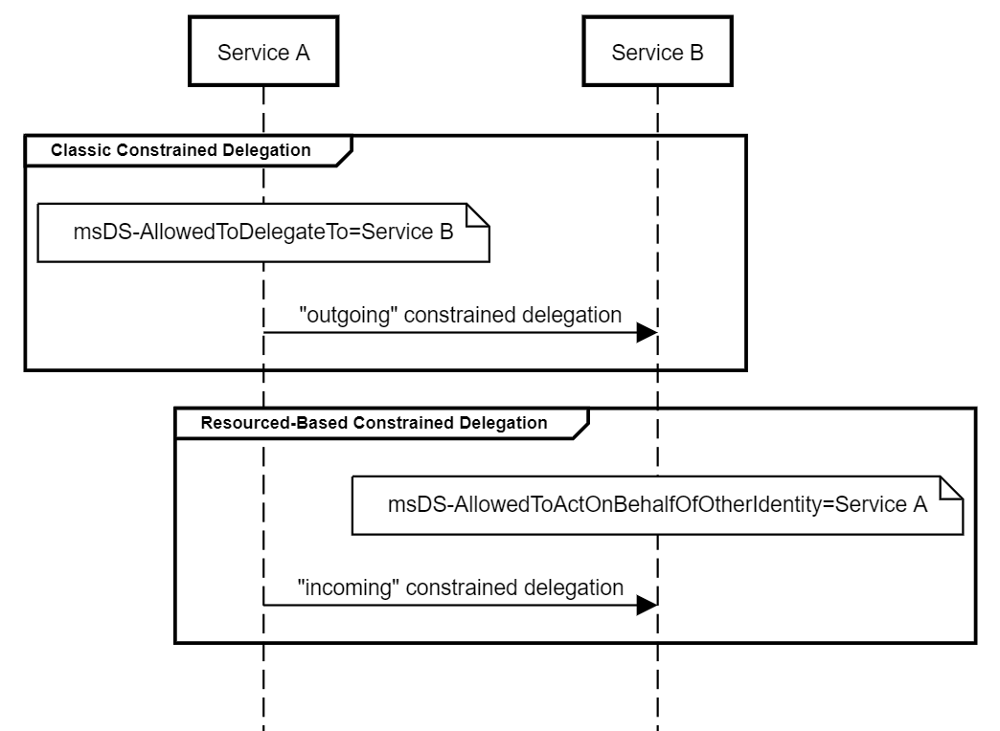

基于资源的约束委派(Resource-Based Constrained Delegation)是一种允许资源自己去设置哪些账户委派给自己的约束委派。

传统的约束委派是“正向的”，通过修改服务 A 属性 `msDS-AllowedToDelegateTo`，添加服务 B 的 SPN（Service Principle Name），设置约束委派对象（服务 B），服务 A 便可以模拟用户向域控制器请求访问服务B以获得服务票据（TGS）来使用服务 B 的资源。

而基于资源的约束委派则是相反的，通过修改服务 B 属性 `msDS-AllowedToActOnBehalfOfOtherIdentity`，添加服务 A 的 SPN，达到让服务 A 模拟用户访问 B 资源的目的。

---

**Reference**

- [深刻理解windows安全认证机制](https://klionsec.github.io/2016/08/10/ntlm-kerberos/)
- [Windows用户密码的加密方法与破解](https://www.sqlsec.com/2019/11/winhash.html#toc-heading-2)
- [Windows下的密码hash——NTLM hash和Net-NTLM hash介绍](https://3gstudent.github.io/3gstudent.github.io/Windows%E4%B8%8B%E7%9A%84%E5%AF%86%E7%A0%81hash-NTLM-hash%E5%92%8CNet-NTLM-hash%E4%BB%8B%E7%BB%8D/)
- [浅学Windows认证](https://b404.xyz/2019/07/23/Study-Windows-Authentication/)
