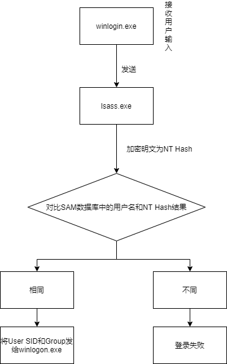
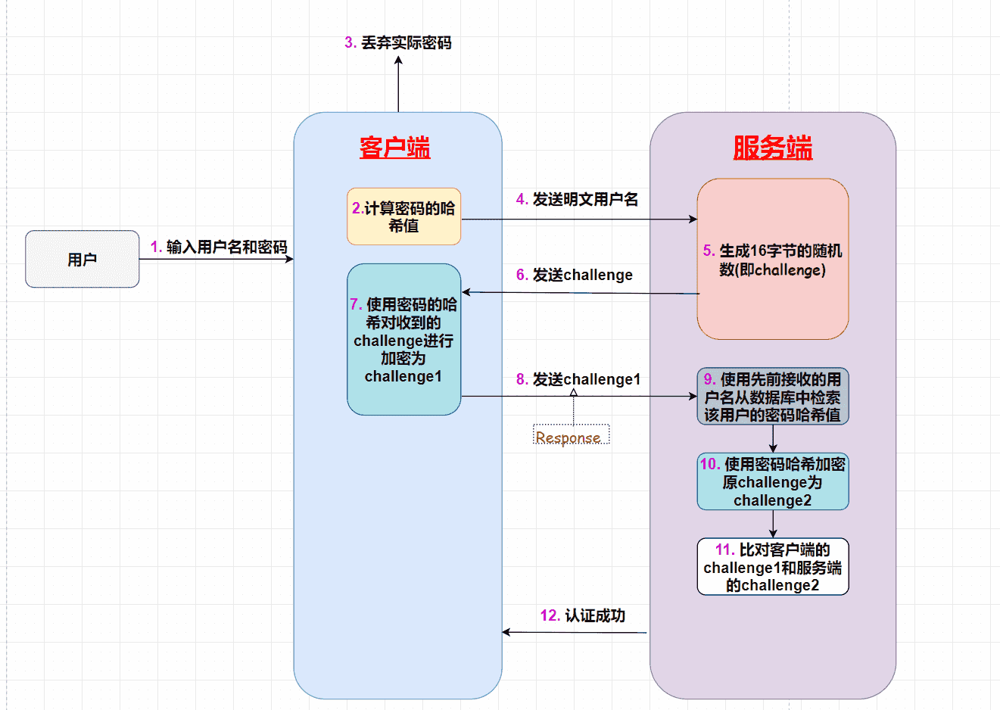

# 认证

---

# 本地认证

在 Windows 系统中本机用户的密码 Hash 是放在本地的 `SAM` 文件里面，域内用户的密码 Hash 是存在域控的 `NTDS.DIT` 文件里面。

sam 的简称是Security Account Manager，安全账户管理器。

Windows XP、Windows Vista、Windows 7、Win 8.1 Win 10 的用户密码以 hash 形式存储在 `%SystemRoot%\system32\config\sam` 数据库文件中。被保存的 hash 分为 `LM Hash` 和 `NTLM hash`；微软在 Windows NT 4.0 中引入 SYSKEY 对 `SAM` 文件加密。

所谓哈希（hash），就是使用一种加密函数进行计算后的结果。这个加密函数对一个任意长度的字符串数据进行一次数学加密函数运算，然后返回一个固定长度的字符串。现在已经有了更新的 NTLMv2 以及 Kerberos 验证体系。Windows 加密过的密码口令，我们称之为 hash，Windows 的系统密码 hash 默认情况下一般由两部分组成：第一部分是 LM-hash，第二部分是 NTLM-hash。

登录系统的时候,系统会自动地读取 `SAM` 文件中的密码与键入的密码进行比对，如果相同，则认证成功。

操作系统启动之后，`SAM` 文件将同时被锁定。这意味着操作系统运行之时，用户无法打开或复制 `SAM` 文件。除了锁定，整个 `SAM` 文件还经过加密，且不可见。

**LM Hash**

LAN Manager（LM）哈希是 Windows 系统所用的第一种密码哈希算法，是一种较古老的 Hash，在 LAN Manager 协议中使用，非常容易通过暴力破解获取明文凭据。它只有唯一一个版本且一直用到了 NT LAN Manager（NTLM）哈希的出现，在 Windows Vista/Windows 7/Windows Server 2008 以及后面的系统中，LM 哈希算法是默认关闭的，LM 算法是在 DES 基础上实现的，不区分字母大小写。
- 生成原理
    1. 用户的密码转换为大写，密码转换为16进制字符串，不足14字节将会用0来再后面补全。
    2. 密码的16进制字符串被分成两个 7byte 部分。每部分转换成比特流，并且长度位 56bit，长度不足用0在左边补齐长度
    3. 再分 7bit 为一组,每组末尾加 0，再组成一组
    4. 上步骤得到的二组，分别作为 key 为 `KGS!@#$%` 进行 DES 加密。
    4. 将加密后的两组拼接在一起，得到最终 LM HASH 值。

**NTLM Hash**

NT LAN Manager（NTLM）哈希是 Windows 系统认可的另一种算法，用于替代古老的 LM-Hash，一般指 Windows 系统下 Security Account Manager（SAM）中保存的用户密码 hash，在 Windows Vista/Windows 7/Windows Server 2008 以及后面的系统中，NTLM 哈希算法是默认启用的。

当用户登录时，将用户输入的明文密码加密成 `NTLM Hash`，与 `SAM` 数据库文件中的 `NTLM Hash` 进行比较。

在渗透测试中，通常可从 Windows 系统中的 `SAM` 文件和域控的 `NTDS.dit` 文件中获得所有用户的 hash，通过 Mimikatz 读取 `lsass.exe` 进程能获得已登录用户的 `NTLM hash`。

- 生成原理
    1. 先将用户密码转换为十六进制格式。
    2. 将十六进制格式的密码进行 Unicode 编码。
    3. 使用 MD4 摘要算法对 Unicode 编码数据进行 Hash 计算

- 快速生成
    ```bash
    python2 -c 'import hashlib,binascii; print binascii.hexlify(hashlib.new("md4", "P@ssw0rd".encode("utf-16le")).digest())'
    ```

**本地认证流程**

```bash
winlogon.exe -> 接收用户输入 -> lsass.exe -> 认证
```

1. 当刚开机、注销等操作后，winlogon.exe 进程会显示一个登录界面要求输入用户名和密码。
2. 输入用户名和密码后，会被 winlogon.exe 获取，然后将其发送给 lsass.exe 进程。
3. lsass.exe 将明文密码计算得到 NT Hash（不考虑LM）。
4. 之后会将用户名和计算得到的 NT Hash 拿到 SAM 数据库去查找比对。



- Windows Logon Process(即 winlogon.exe)，是Windows NT 用户登陆程序，用于管理用户登录和退出。
- LSASS 用于微软 Windows 系统的安全机制。用于本地安全和登陆策略。

---

# 网络认证

在内网渗透中，经常遇到工作组环境，而工作组环境是一个逻辑上的网络环境(工作区)，隶属于工作组的机器之间无法互相建立一个完美的信任机制，只能点对点，是比较落后的认证方式，没有信托机构。

假设 A 主机与 B 主机属于同一个工作组环境，A 想访问 B 主机上的资料，需要将一个存在于 B 主机上的账户凭证发送至 B 主机，经过认证才能够访问 B 主机上的资源。

这是我们接触比较多的 SMB 共享文件的案例，SMB 的默认端口是 445。

早期 SMB 协议在网络上传输明文口令。后来出现 LAN Manager Challenge/Response 验证机制，简称 LM，它很容易被破解，就又有了 NTLM 以及 Kerberos。

**Net-NTLM hash**

NTLM 是一种网络认证协议,以 NTLM Hash 作为凭证进行认证。NTLM Hash 长度为32位，由数字和字母组成,采用挑战/响应（Challenge/Response）的消息交换模式，流程如下：

1. 客户端向服务器发送一个请求，请求中包含明文的登录用户名。服务器会提前存储登录用户名和对应的密码 hash
2. 服务器接收到请求后，生成一个16位的随机数(这个随机数被称为 Challenge),明文发送回客户端。使用存储登录用户密码 hash 加密 Challenge，获得 Challenge1
3. 客户端接收到 Challenge 后，使用登录用户的密码 hash 对 Challenge 加密，获得 Challenge2(这个结果被称 response)，将 response 发送给服务器
4. 服务器接收客户端加密后的 response，比较 Challenge1 和 response，如果相同，验证成功



在以上流程中，登录用户的密码 hash 即 NTLM hash，response 中包含 Net-NTLM hash

在 NTLM 认证中，NTLM 响应分为 NTLM v1，NTLMv2，NTLM session v2 三种协议，不同协议使用不同格式的 Challenge 和加密算法

所以也就存在不同协议的 Net-NTLM hash，即 Net-NTLM v1 hash，Net-NTLM v2 hash

**NTLMv2 协议**

NTLMv1 和 NTLMv2 的加密因素都是 NTLM Hash，而最显著的区别就是 Challenge 和加密算法不同：
- Challage： NTLMv1 的 Challenge 有8位，NTLMv2 的 Challenge 为16位。
- Net-NTLM Hash：NTLMv1 的主要加密算法是 DES，NTLMv2 的主要加密算法是 HMAC-MD5。

## PTH

详细内容见 [后渗透](../../../安全/笔记/RedTeam/后渗透.md#PTHPTKPTT) PTH 部分

---

# 域认证

## AD

## Kerberos


---

**Reference**

- [深刻理解windows安全认证机制](https://klionsec.github.io/2016/08/10/ntlm-kerberos/)
- [Windows用户密码的加密方法与破解](https://www.sqlsec.com/2019/11/winhash.html#toc-heading-2)
- [Windows下的密码hash——NTLM hash和Net-NTLM hash介绍](https://3gstudent.github.io/3gstudent.github.io/Windows%E4%B8%8B%E7%9A%84%E5%AF%86%E7%A0%81hash-NTLM-hash%E5%92%8CNet-NTLM-hash%E4%BB%8B%E7%BB%8D/)
- [浅学Windows认证](https://b404.xyz/2019/07/23/Study-Windows-Authentication/)
